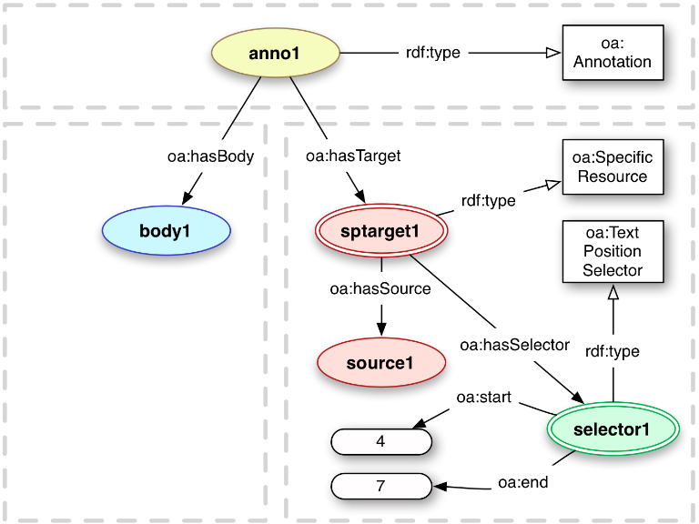

# Towards an interoperability architecture
----

<!-- # Interoperability scenarios
## Non exhaustive

1. Long-running Services, such as assembl message extraction or analytics
2. Data exchange between platforms
3. Encapsulated widgets (eg visualization)
4. Frankentool (shallow integration)
6. Single sign on using accounts on other services
7. Single sign on with catalyst tools
8. Pre-classification of harvested content (in bookmarklet)

# Unlikely interoperability scenarios

1. Concept map manipulation in other platforms
2. Deep visual integration of consortium tools

# Interoperability components

* Message (posts) exchange
* Display individual visualizations
    * static or interactive
* Single sign-on
* Exchange attention mediation
* Displaying one tool into another
* Exchange IBIS structures
* Configuration data of other tools
* Data unification
-->

# Components

<dot>
digraph g {
    graph [bgcolor="transparent", rankdir="BT"] ;
    node [fillcolor=white, style=filled,  shape=record];
    comm [label="Communicatin platform"];
    viz [label="Visualization Module"];
    ibis [label="IBIS database"];
    postdb [label="post database"];
    analytics [label="analytics engine"];
    gred [label="ibis graph editor"];
    comm->ibis [label="bookmarklets"];
    comm->postdb [label="data converters"];
    viz->comm [label="embed"];
    viz->gred [label="embed"];
    analytics->gred [label="report results"];
    analytics->comm [label="report results?"];
    ibis->viz;
    ibis->gred [dir=both];
    ibis->analytics;
    postdb->analytics;
    postdb->gred [label="Assembl embedding"];
}
</dot>

----
# How to interoperate: REST
## Eg. post exchange, analytics exchange

* Define list of endpoints in configuration
* Agree on data format
* CRUD

----
# How to interoperate: JSON-LD and Sparql

* JSON-LD hides RDF nature of data
* Underlying RDF nature allows Sparql graph queries
* SPARUL?

----
# Exchange attention mediation
## Events between platforms and tools

TBD. Options include:

* Ping to pull
* 0MQ
* Websockets
* AMQP

----
# Displaying one tool into another

1. Encapsulated
2. Data storage on platform server (security issue)
3. Data storage on viz server (involves CSRF)
4. Display logic on viz server (Widgets)

4th case is most technically involved. Maybe use OpenSocial spec.

----
# Bookmarklets

* Do we share bookmarklets?
* Annotator, Pund.it, work of OpenU.

----
# Security Issues

* Per-discussion access with pseudonomized user references.
* Per discussion pseudonyms ? Use same-as.
* Separate access to user data, necessary for tools themselves.

----
# The information model

* Ibis
* SIOC
* OpenAnnotation
* Votes
* Change History

----
# Example data: Simple IBIS

<dot>
digraph g {
    graph [bgcolor="transparent", rankdir="BT"] ;
    node [fillcolor=white, style=filled,  shape=record];
    Issue1 [label="{Issue 1|Stop climate change}"];
    Option1 [label="{Option 1|We should telecommute}"];
    Argument1 [label="{Argument 1|Personal transport is a big part of fuel consumption}"];
    Option1 -> Issue1;
    Argument1 -> Option1   [label="supports", color="green"];
}
</dot>

----
# Simple IBIS in RDF (Turtle syntax)

    :::turtle
    eg_d1:idea_1 a ibis:Issue;
        dcterms:title "Stop climate change"@eng;
        dcterms:description "A longer description"@eng.
    
    eg_d1:idea_2 a ibis:Position;
        dcterms:title "We should telecommute"@eng.
    
    eg_d1:idealink_2_1 a ibis:PositionRespondsToIssue;
        ibis:response_position eg_d1:idea_2;
        ibis:response_issue eg_d1:idea_1 .
    
    eg_d1:idea_3 a ibis:Argument;
        dcterms:title """Personal transport is a big part 
            of fuel consumption."""@eng.
    
    eg_d1:idealink_3_2 a ibis:ArgumentSupportsPosition;
        ibis:argument_supporting eg_d1:idea_3;
        ibis:position_supported eg_d1:idea_2.

----
# Simple IBIS, RDF graph

<dot>
digraph g {
    graph [bgcolor="transparent", rankdir="BT"] ;
    node [fillcolor=white, style=filled,  shape=record];
    idea1 [label=<<table border='0' cellborder='0' cellpadding='0' cellspacing='0'>
        <tr><td>eg_d1:idea_1 a <U>ibis:Issue</U></td></tr>
        <tr><td>dcterms:title='Stop climate change'@eng</td></tr>
    </table>>];
    idea2 [label=<eg_d1:idea_2 a <U>ibis:Option</U> dcterms:title='We should telecommute'@eng>];
    idea3 [label=<eg_d1:idea_3 a <U>ibis:Argument</U> dcterms:title='Personal transport is a big part of fuel consumption'@eng>];
    link21 [label=<eg_d1:idealink_2_1 a <U>ibis:PositionRespondsToIssue</U>>, shape="oval"];
    link21->idea1 [label="ibis:response_issue"];
    idea2->link21 [label="ibis:response_position", dir="back"];
    link32 [label=<eg_d1:idealink_3_2 a <U>ibis:ArgumentSupportsPosition</U>>, shape="oval"]
    idea3->link32 [label="ibis:argument_supporting", dir="back"];
    link32->idea2 [label="ibis:position_supported"];
}
</dot>
{: .tall }

----
# Json-LD on the wire
## More verbose, but easy for a machine

    :::json
    {
        "@context": {
            "dcterms": "http://purl.org/dc/terms/",
            "ibis": "http://purl.org/catalyst/ibis",
            "eg_site": "http://www.assembl.net/",
            "eg_d1": "http://www.assembl.net/discussion/1/"
        },
        "@graph": [
        {
            "@id": "eg_d1:idea_1",
            "@type": "ibis:Issue",
            "dcterms:title": {
                "@language": "eng",
                "@value": "How to represent links"
            },
            "dcterms:description": {
                "@language": "eng",
                "@value": "A longer description "
            }
        },
        {
            "@id": "eg_d1:idealink_2_1",
            "@type": "ibis:PositionRespondsToIssue",
            "ibis:response_issue": {
                "@id": "eg_d1:idea_1"
            },
            "ibis:response_position": {
                "@id": "eg_d1:idea_2"
            }
        },
        ...
        ]
    }

----
# Ibis ontology redux

----
# Query: how many positive arguments?

    :::sparql
    SELECT COUNT(DISTINCT ?arg) WHERE {
        ?asp a ibis:ArgumentSupportsPosition .
        ?asp ibis:argument_supporting ?arg
    }

`=> 1`

----
# Ideas come from somewhere
## Authors and containers: FOAF, DCTerms, SIOC

    :::turtle
    eg_d1:idea_1 a ibis:Issue;
        dcterms:title "Stop climate change"@eng;
        dcterms:description "A longer description "@eng;
        sioc:has_creator eg_site:user_maparent;
        dcterms:created "2013-11-02T14:20:04"^^<xsd:dateTimeStamp>;
        dcterms:modified "2014-01-02T11:32:17"^^<xsd:dateTimeStamp>;
        sioc:has_container eg_d1:ideas.

----
# Graph with authors

<dot>
digraph g {
    graph [bgcolor="transparent", rankdir="BT"] ;
    node [fillcolor=white, style=filled,  shape=record];
    idea1 [label=<<table border='0' cellborder='0' cellpadding='0' cellspacing='0'><tr><td>eg_d1:idea_1 a ibis:Issue</td></tr><tr><td>dcterms:title='Stop climate change'@eng</td></tr><tr><td>dcterms:created '2013-11-02T14:20:04'^^&lt;xsd:dateTimeStamp&gt;</td></tr><tr><td>dcterms:modified '2014-01-02T11:32:17'^^&lt;xsd:dateTimeStamp&gt;</td></tr></table>>];
    user1 [label="eg_site:user_maparent a foaf:Person", color="green"];
    idea1->user1 [label="sioc:has_creator", color="green"];
    ideasContainer [label="eg_d1:ideas a sioc:Container", color="green"];
    idea1->ideasContainer [label="sioc:has_container", color="green"];
}
</dot>

----
# Query: Who contributed most ideas?

    :::sparql
    DEFINE input:inference <http://www.assembl.net/Rules>
    PREFIX idea: <http://purl.org/catalyst/idea#>
    PREFIX ibis: <http://purl.org/catalyst/ibis#>
    SELECT ?u WHERE {
        ?i sioc:has_creator ?u .
        ?i a idea:GenericIdea
    }
    ORDER BY DESC(COUNT(?i)) LIMIT 1

Virtuoso note: we use a named Ruleset to use the fact that 

    ::n3
    ibis:Issue rdfs:subClassOf idea:GenericIdea

----
# The sioc model

______
# A discussion using the sioc model

<dot>
digraph g {
    graph [bgcolor="transparent", rankdir="TB", compound="true"];
    node [fillcolor=white, style=filled,  shape=record, fontsize=9];
    edge [fontsize=8];
    users [label=<eg_site:users a <U>sioc:Usergroup</U>>, color="green"];
    users->site [label="sioc:usergroup_of", color="green"];
    forum [label=<eg_d1:forum a <U>sioc:Forum</U>>, color="green"];
    site [label=<&lt;http://www.assembl.net/&gt; a <U>sioc:Site</U>>, color="green"];
    forum->site [label="sioc:host_of", color="green", dir="back"];
    member_role [label=<eg_d1:d1_member a <U>sioc:Role</U>>, color="green"];
    member_role->discussion [label="sioc:has_scope", color="green"];
    discussion [label=<&lt;http://www.assembl.net/discussion/1/&gt;  a <U>assembl:Discussion</U>, <U>sioc:Container</U>>, color="green"];
    forum [label=<eg_d1:forum a <U>sioc:Forum</U>>, color="green"];
    ideasContainer [label=<eg_d1:ideas a <U>sioc:Container</U>>, color="green"];
    forum->discussion [label="sioc:part_of", color="green"];
    ideasContainer->discussion [label="sioc:part_of", color="green"];
}
</dot>

______
# A discussion using the sioc model

    :::turtle
    @prefix eg_site: <http://www.assembl.net/> .
    @prefix eg_d1: <http://www.assembl.net/discussion/1/> .
    
    <http://www.assembl.net/> a sioc:Site ;
        sioc:host_of eg_d1:forum.
    
    <http://www.assembl.net/discussion/1/> 
        a assembl:Discussion, sioc:Container.
    
    eg_d1:forum a sioc:Forum ;
        sioc:part_of eg_site:discussing_ibis .
    
    eg_d1:ideas a assembl:Ideas, sioc:Container;
        sioc:part_of <http://www.assembl.net/discussion/1/> .
    
    eg_site:users a sioc:Usergroup;
        sioc:usergroup_of <http://www.assembl.net>.
    
    eg_d1:d1_member a sioc:Role;
        sioc:has_scope <http://www.assembl.net/discussion/1/> .

----
# And a member of the discussion

<dot>
digraph g {
    graph [bgcolor="transparent", rankdir="LR", compound="true"];
    node [fillcolor=white, style=filled,  shape=record, fontsize=9];
    edge [fontsize=8];
    person1 [label=<<table border='0' cellborder='0' cellpadding='0' cellspacing='0'>
        <tr><td>eg_site:agent_maparent a <U>foaf:Person</U></td></tr>
        <tr><td>foaf:familyName 'Marc-Antoine'</td></tr>
        <tr><td>foaf:lastName 'Parent'</td></tr>
        </table>>];
    user1 [label=<<table border='0' cellborder='0' cellpadding='0' cellspacing='0'>
        <tr><td>eg_site:user_maparent a <U>sioc:UserAccount</U></td></tr>
        <tr><td>sioc:email "maparent@acm.org"</td></tr>
        </table>>, color="green"];
    user1->person1 [label="sioc:account_of", color="green"];
    user1->users [label="sioc:member_of", color="green"];
    user1->member_role [label="sioc:has_function", color="green"];
    users [label=<eg_site:users a <U>sioc:Usergroup</U>>];
    users->site [label="sioc:usergroup_of"];
    forum [label=<eg_d1:forum a <U>sioc:Forum</U>>];
    site [label=<&lt;http://www.assembl.net/&gt; a <U>sioc:Site</U>>];
    forum->site [label="sioc:host_of", dir="back"];
    member_role [label=<eg_d1:d1_member a <U>sioc:Role</U>>];
    member_role->discussion [label="sioc:has_scope"];
    discussion [label=<&lt;http://www.assembl.net/discussion/1/&gt;  a <U>assembl:Discussion</U>, <U>sioc:Container</U>>];
    forum->discussion [label="sioc:part_of", color="green"];
    ideasContainer->discussion [label="sioc:part_of", color="green"];
}
</dot>

----
# And a member of the discussion

    :::turtle
    @prefix eg_site: <http://www.assembl.net/> .
    @prefix eg_d1: <http://www.assembl.net/discussion/1/> .
    
    eg_site:agent_maparent a foaf:Person;
        foaf:familyName "Marc-Antoine";
        foaf:firstName "Parent".
    
    eg_site:user_maparent a sioc:UserAccount;
        sioc:account_of eg_site:agent_maparent;
        sioc:has_function eg_d1:d1_member;
        sioc:member_of eg_site:users;
        sioc:email "maparent@acm.org".
    
    eg_site:agent_benoitg a foaf:Person;
        foaf:familyName "Grégoire";
        foaf:firstName "Benoît".

----

# A post

<dot>
digraph g {
    graph [bgcolor="transparent", rankdir="TB", compound="true"];
    node [fillcolor=white, style=filled,  shape=record, fontsize=9];
    edge [fontsize=8];
    user1 [label=<<table border='0' cellborder='0' cellpadding='0' cellspacing='0'>
        <tr><td>eg_site:user_maparent a <U>sioc:UserAccount</U></td></tr>
        <tr><td>sioc:email "maparent@acm.org"</td></tr>
        </table>>];
    user2 [label=<<table border='0' cellborder='0' cellpadding='0' cellspacing='0'>
        <tr><td>eg_site:user_benoitg a <U>sioc:UserAccount</U></td></tr>
        <tr><td>sioc:email "benoitg@coeus.ca"</td></tr>
        </table>>];
    forum [label=<eg_d1:forum a <U>sioc:Forum</U>>];
    post1 [label=<<table border='0' cellborder='0' cellpadding='0' cellspacing='0'>
        <tr><td>eg_d1:message_1 a <U>sioc:Post</U></td></tr>
        <tr><td>dcterms:title "Climate change is a real problem"@eng</td></tr>
        <tr><td>sioc:content "We need to reduce CO2 levels."@eng</td></tr>
        <tr><td>sioc:addressed_to "discussion1@assembl.net"</td></tr>
    </table>>, color="green"];
    post1->user1 [label="sioc:has_creator", color="green"];
    post1->forum [label="sioc:has_container", color="green"];
    post2 [label=<<table border='0' cellborder='0' cellpadding='0' cellspacing='0'>
        <tr><td>eg_d1:message_2 a <U>sioc:Post</U></td></tr>
        <tr><td>dcterms:title "Telecommuting might help"@eng</td></tr>
    </table>>, color="green"];
    post2->user2 [label="sioc:has_creator", color="green"];
    post2->user1 [label="sioc:addressed_to", color="green"];
    post2->forum [label="sioc:has_container", color="green"];
    post2->post1 [label="sioc:reply_of", color="green"];
}
</dot>

----
# A post

    :::turtle
    eg_d1:message_1 a sioc:Post ;
        dcterms:created "2013-11-01T09:00:04"^^<xsd:dateTimeStamp>;
        dcterms:title "Climate change is a real problem"@eng;
        sioc:content """We need to reduce CO2 levels."""@eng;
        sioc:has_creator eg_site:user_maparent;
        sioc:addressed_to "discussion1@assembl.net";
        sioc:has_container eg_d1:forum.
    
    eg_d1:message_2 a sioc:Post ;
        dcterms:title "Telecommuting might help"@eng;
        sioc:has_creator eg_site:user_benoitg;
        sioc:addressed_to eg_site:user_maparent;
        sioc:has_container eg_d1:forum;
        sioc:reply_of eg_d1:message_1.

----
# Query: Most replied-to post

    :::sparql
    DEFINE input:inference <http://www.assembl.net/Rules>
    SELECT ?post WHERE {
        ?post a sioc:Post .
        ?post sioc:has_reply+ ?reply
    } ORDER BY DESC(COUNT(?reply)) LIMIT 1

Note the use of 

    :::turtle
    sioc:has_reply owl:inferseOf sioc:reply_to

----
# Commenting on the post

<dot>
digraph g {
    graph [bgcolor="transparent", rankdir="TB", compound="true"];
    node [fillcolor=white, style=filled,  shape=record, fontsize=9];
    edge [fontsize=8];
    post1 [label=<<table border='0' cellborder='0' cellpadding='0' cellspacing='0'>
        <tr><td>eg_d1:message_1 a <U>sioc:Post</U></td></tr>
        <tr><td>dcterms:title "Climate change is a real problem"@eng</td></tr>
        <tr><td>sioc:content "We need to reduce CO2 levels."@eng</td></tr>
        <tr><td>sioc:addressed_to "discussion1@assembl.net"</td></tr>
    </table>>];
    extract1 [label=<eg_d1:extracts_1 a <U>oa:SpecificResource</U>>, color="green"];
    selection1 [label=<<table border='0' cellborder='0' cellpadding='0' cellspacing='0'>
        <tr><td>_ a <U>oa:TextPositionSelector</U></td></tr>
        <tr><td>oa:start "18"^^&lt;xsd:integer&gt;</td></tr>
        <tr><td>oa:end "28"^^&lt;xsd:integer&gt;</td></tr>
        <tr><td>oa:exact "CO2 levels"</td></tr>
    </table>>, color="green"];
    extract1->selection1 [label="oa:hasSelector", color="green"];
    extract1->post1 [label="oa:hasSource", color="green"];
    annotation1 [label=<eg_d1:annotations_1 a <U>oa:Annotation</U>>, color="green"];
    annotation1->extract1 [label="oa:hasTarget", color="green"];
    annotation1->cluster_ann1 [label="oa:hasBody", color="green"];
    cluster_ann1 [label=<eg_site:annotation_1_target a <U>trig:Graph</U>>, color="green"];
}
</dot>

----
# Commenting on the post

    :::turtle
    eg_d1:extracts_1 a oa:SpecificResource;
        oa:hasSource eg_d1:message_1;
        oa:hasSelector [
            a oa:TextPositionSelector;
            oa:start "18"^^<xsd:integer>;
            oa:end "28"^^<xsd:integer>;
            oa:exact "CO2 levels"@eng
        ].
    
    eg_d1:annotations_1 a oa:Annotation;
        oa:hasTarget eg_d1:extracts_1;
        oa:hasBody eg_site:annotation_1_target.

----
# Open annotation source

----
# Relating the comment to the idea

<dot>
digraph g {
    graph [bgcolor="transparent", rankdir="TB", compound="true"];
    node [fillcolor=white, style=filled,  shape=record, fontsize=10];
    edge [fontsize=9];
    post1 [label=<eg_d1:message_1 a <U>sioc:Post</U>>];
    extract1 [label=<eg_d1:extracts_1 a <U>oa:SpecificResource</U>>];
    extract1->post1 [label="oa:hasSource"];
    annotation1 [label=<eg_d1:annotations_1 a <U>oa:Annotation</U>>];
    annotation1->extract1 [label="oa:hasTarget"];
    annotation1->idea1_alias [label="oa:hasBody", color="green", lhead="cluster_ann1"];
    subgraph cluster_ann1 {
        graph [bgcolor="transparent", rankdir="TB", compound="true", style="dashed",
            label=<eg_site:annotation_1_target a <U>trig:Graph</U>>, fontsize=10];
        idea1_alias [label="eg_d1:idea_1", style="dotted", color="green"];
        extract1_alias [label="eg_d1:extracts_1", style="dotted", color="green"];
        extract1_alias -> idea1_alias [label="assembl:expressesIdea", color="green"];
    }
    idea1->idea1_alias [style="dotted", arrowhead="none", color="green"];
    extract1->extract1_alias [style="dotted", arrowhead="none", color="green"];
    idea1 [label=<eg_d1:idea_1 a <U>ibis:Issue</U>>];
}
</dot>

----
# Relating the comment to the idea

    :::turtle
    eg_d1:annotations_1 a oa:Annotation;
        oa:hasTarget eg_d1:extracts_1;
        oa:hasBody eg_site:annotation_1_target.
    
    eg_site:annotation_1_target a trig:Graph.
    
    # The annotation body (a named graph) links the text extract to an idea.
    eg_site:annotation_1_target = {
        eg_d1:extracts_1 assembl:expressesIdea eg_d1:idea_1.
    }

----
# Open annotation target as graph

Note that they recommend to send semantic content using ContentAsText. Named graphs/reification are mentioned as an option, if justified.

----
# Query: Whose content illustrates an idea?

    :::sparql

    DEFINE input:inference <http://www.assembl.net/Rules>
    SELECT ?person WHERE {
            ?person sioc:creator_of ?post .
            ?extract oa:hasSource ?post .
            ?annotation oa:hasTarget ?extract .
            ?annotation oa:hasBody ?subgraph .
            GRAPH ?subgraph {
                ?extract assembl:expressesIdea eg_d1:idea_1
            }
    } ORDER BY DESC(COUNT(?extract)) LIMIT 1

Fortunately, searching in subgraphs is quite doable.

----
# Voting

<dot>
digraph g {
    graph [bgcolor="transparent", rankdir="TB", compound="true"];
    node [fillcolor=white, style=filled,  shape=record, fontsize=9];
    edge [fontsize=9];
    idea3 [label=<eg_d1:idea_3 a <U>ibis:Argument</U>>];
    user2 [label=<<table border='0' cellborder='0' cellpadding='0' cellspacing='0'>
        <tr><td>eg_site:user_benoitg a <U>sioc:UserAccount</U></td></tr>
        <tr><td>sioc:email "benoitg@coeus.ca"</td></tr>
        </table>>];
    vote1 [label=<<table border='0' cellborder='0' cellpadding='0' cellspacing='0'>
        <tr><td>eg_d1:vote1 a <U>vote:BinaryVote</U></td></tr>
        <tr><td>vote:positive "true"^^&lt;xsd:boolean&gt;</td></tr>
    </table>>, color="green"];
    vote1->idea3 [label="vote:subject", color="green"];
    vote1->user2 [label="vote:voter", color="green"];
}
</dot>

----
# Voting

    :::turtle
    eg_d1:vote1 a vote:BinaryVote;
        vote:voter eg_site:user_benoitg;
        dcterms:created "2013-11-02T14:20:04"^^<xsd:dateTimeStamp>;
        vote:subject eg_d1:idea_3;
        vote:positive "true"^^<xsd:boolean>.

----
# Lickert Voting

<dot>
digraph g {
    graph [bgcolor="transparent", rankdir="TB", compound="true"];
    node [fillcolor=white, style=filled,  shape=record, fontsize=9];
    edge [fontsize=9];
    idea3 [label=<eg_d1:idea_3 a <U>ibis:Argument</U>>];
    user2 [label=<<table border='0' cellborder='0' cellpadding='0' cellspacing='0'>
        <tr><td>eg_site:user_benoitg a <U>sioc:UserAccount</U></td></tr>
        <tr><td>sioc:email "benoitg@coeus.ca"</td></tr>
        </table>>];
    vote2 [label=<<table border='0' cellborder='0' cellpadding='0' cellspacing='0'>
        <tr><td>eg_d1:vote2 a <U>vote:LickertVote</U></td></tr>
        <tr><td>vote:value "8"^^&lt;xsd:integer&gt;</td></tr>
    </table>>, color="green"];
    vote_range [label=<<table border='0' cellborder='0' cellpadding='0' cellspacing='0'>
        <tr><td>eg_d1:vote_range a <U>vote:LickertRange</U></td></tr>
        <tr><td>vote:min "1"^^&lt;xsd:integer&gt;</td></tr>
        <tr><td>vote:max "10"^^&lt;xsd:integer&gt;</td></tr>
    </table>>, color="green"];
    vote2->idea3 [label="vote:subject", color="green"];
    vote2->user2 [label="vote:voter", color="green"];
    vote2->vote_range [label="vote:lickert_in_range", color="green"];
}
</dot>

----
# Lickert Voting

    :::turtle
    eg_d1:vote_range a vote:LickertRange;
        vote:min "1"^^xsd:integer;
        vote:max "10"^^xsd:integer.
    
    eg_d1:vote2 a vote:LickertVote;
        vote:voter eg_site:user_benoitg;
        vote:subject eg_d1:idea_3;
        vote:lickert_in_range eg_d1:vote_range;
        vote:lickert_value "8"^^xsd:integer.

----
# Ordered voting

<dot>
digraph g {
    graph [bgcolor="transparent", rankdir="TB", compound="true"];
    node [fillcolor=white, style=filled,  shape=record, fontsize=9];
    edge [fontsize=9];
    idea3 [label=<eg_d1:idea_3 a <U>ibis:Argument</U>>];
    idea4 [label=<eg_d1:idea_4 a <U>ibis:Argument</U>>];
    idea5 [label=<eg_d1:idea_5 a <U>ibis:Argument</U>>];
    user2 [label=<<table border='0' cellborder='0' cellpadding='0' cellspacing='0'>
        <tr><td>eg_site:user_benoitg a <U>sioc:UserAccount</U></td></tr>
        <tr><td>sioc:email "benoitg@coeus.ca"</td></tr>
        </table>>];
    vote3 [label=<<table border='0' cellborder='0' cellpadding='0' cellspacing='0'>
        <tr><td>eg_d1:vote3 a <U>vote:OrderingVote</U></td></tr>
    </table>>, color="green"];
    vote3->idea3 [label="vote:subject", color="green"];
    vote3->idea4 [label="vote:subject", color="green"];
    vote3->idea5 [label="vote:subject", color="green"];
    vote3->user2 [label="vote:voter", color="green"];
    vote_seq1 [label=<_ a <U>rdf:Seq</U>>, color="green"];
    vote3->vote_seq1 [label="vote:ordered_ideas", color="green"];
    vote_seq1->idea3 [label="_1"];
    vote_seq1->idea5 [label="_2"];
    vote_seq1->idea4 [label="_3"];
}
</dot>

----
# Ordered voting

    :::turtle
    eg_d1:vote3 a vote:OrderingVote;
        vote:voter eg_site:user_benoitg;
        vote:ordered_ideas [ a rdf:Seq;
            rdf:_1 eg_d1:idea3;
            rdf:_2 eg_d1:idea5;
            rdf:_3 eg_d1:idea4 ].

----
# Query: are you a negative voter?

    :::sparql
    DEFINE input:inference <http://www.assembl.net/Rules>
    PREFIX vote: <http://purl.org/catalyst/vote#>
    SELECT ?person WHERE {
        SELECT ?person (COUNT(?lickert_vote) AS ?total)
               (COUNT(?negVote) AS ?negatives) 
        WHERE {
            ?lickert_vote vote:voter ?person .
            ?lickert_vote a vote:LickertVote .
            OPTIONAL {
                ?negVote vote:voter ?person .
                ?negVote a vote:LickertVote .
                ?negVote vote:lickert_in_range ?range .
                ?negVote vote:lickert_value ?vote_val .
                ?range vote:min ?lickertMin .
                ?range vote:max ?lickertMax .
                BIND ((?vote_val - ?lickertMin + 0.0)/
                      (?lickertMax/?lickertMin) AS ?lickertNorm).
                FILTER (?vote_val > 0.5)
            }
        } 
    }  ORDER BY DESC (?negatives / ?total) LIMIT 1

----
# Change log
## Creation event

<dot>
digraph g {
    graph [bgcolor="transparent", rankdir="BT", compound="true"];
    node [fillcolor=white, style=filled,  shape=record];
    user1 [label=<eg_site:user_maparent a <U>sioc:UserAccount</U>>];
    post1 [label=<<table border='0' cellborder='0' cellpadding='0' cellspacing='0'>
        <tr><td>eg_d1:message_1 a <U>sioc:Post</U></td></tr>
        <tr><td>dcterms:title "Climate change is a real problem"@eng</td></tr>
        <tr><td>sioc:content "We need to reduce CO2 levels."@eng</td></tr>
        <tr><td>sioc:addressed_to "discussion1@assembl.net"</td></tr>
    </table>>];
    post1->user1 [label="sioc:has_creator"];
    ch_148 [label=<<table border='0' cellborder='0' cellpadding='0' cellspacing='0'>
    <tr><td>eg_d1:change_148 a <U>version:Create</U></td></tr>
    <tr><td>version:change_version "0"^^&lt;xsd:integer&gt;</td></tr>
    </table>>, color="green"];
    ch_148->user1 [label="version:access_author", color="green"];
    post1->ch_148 [label="version:latest_change", color="green"];
    ch_148->post1 [label="version:target", color="green"];
    ch_148_data [label=<<table border='0' cellborder='0' cellpadding='0' cellspacing='0'>
    <tr><td>_ version:type <u>sioc:Post</u></td></tr>
    <tr><td>dcterms:title "Climate change is a real problem"@eng</td></tr>
    <tr><td>sioc:content "Initial text of the post."@eng</td></tr>
    </table>>, color="green"];
    ch_148->ch_148_data [label="version:initial_data", color="green"];
}
</dot>

----
# Change log
## Creation event

    :::turtle
    eg_d1:message_1 version:latest_change eg_d1:change_148.
    eg_d1:change_148
        a version:Create;
        version:target eg_d1:message_1;
        version:access_author eg_site:user_maparent;
        version:change_version "0"^^<xsd:integer>;
        version:initial_data [
            dcterms:created "2013-11-01T09:00:04"^^<xsd:dateTimeStamp>;
            dcterms:title "Climate change is a real problem"@eng;
            sioc:content """Initial text of the post."""@eng;
            sioc:has_creator eg_site:user_maparent;
            sioc:has_container eg_d1:forum.
        ].

----
# Change log
## Property change

<dot>
digraph g {
    graph [bgcolor="transparent", rankdir="BT", compound="true"];
    node [fillcolor=white, style=filled,  shape=record, fontsize=9];
    edge [fontsize=8];
    user1 [label=<eg_site:user_maparent a <U>sioc:UserAccount</U>>];
    post1 [label=<<table border='0' cellborder='0' cellpadding='0' cellspacing='0'>
        <tr><td>eg_d1:message_1 a <U>sioc:Post</U></td></tr>
    </table>>];
    post1->user1 [label="sioc:has_creator"];
    ch_148 [label=<<table border='0' cellborder='0' cellpadding='0' cellspacing='0'>
    <tr><td>eg_d1:change_148 a <U>version:Create</U></td></tr>
    <tr><td>version:change_version "0"^^&lt;xsd:integer&gt;</td></tr>
    </table>>];
    ch_148->user1 [label="version:access_author"];
    ch_189 [label=<<table border='0' cellborder='0' cellpadding='0' cellspacing='0'>
    <tr><td>eg_d1:change_189 a <U>version:PropertyChange</U></td></tr>
    <tr><td>version:change_version "2"^^&lt;xsd:integer&gt;</td></tr>
    </table>>, color="green"];
    ch_189->user1 [label="version:access_author", color="green"];
    post1->ch_189 [label="version:latest_change", color="green"];
    ch_189->post1 [label="version:target", color="green"];
    ch_189_data [label=<<table border='0' cellborder='0' cellpadding='0' cellspacing='0'>
    <tr><td>_</td></tr>
    <tr><td>sioc:content "We need to reduce CO2 levels."@eng</td></tr>
    </table>>, color="green"];
    ch_189->ch_189_data [label="version:initial_data", color="green"];
    ch_189->ch_172 [label="version:previous_change", color="green"];
    ch_172 [label=<<table border='0' cellborder='0' cellpadding='0' cellspacing='0'>
    <tr><td>eg_d1:change_172 a <U>version:Access</U></td></tr>
    <tr><td>version:change_version "1"^^&lt;xsd:integer&gt;</td></tr>
    </table>>, color="green"];
    ch_172->user1 [label="version:access_author", color="green"];
    ch_172->post1 [label="version:target", color="green"];
    ch_172->ch_148 [label="version:previous_change", color="green"];
}
</dot>

----
# Change log.
## Property change

    :::turtle
    eg_d1:message_1 version:latest_change eg_d1:change_189.
    eg_d1:change_189
        a version:PropertyChange;
        version:target eg_d1:message_1;
        version:change_version "2"^^<xsd:integer>;
        version:access_author eg_site:user_maparent;
        version:new_properties [
            sioc:content """We need to reduce CO2 levels."""@eng;
        ];
        version:previous_change eg_d1:change_172.
    eg_d1:change_172
        a version:Access;
        version:target eg_d1:message_1;
        version:access_author eg_site:user_maparent;
        version:previous_change eg_d1:change_148.

----
# Do we need transactions?

<dot>
digraph g {
    graph [bgcolor="transparent", rankdir="BT", compound="true"];
    node [fillcolor=white, style=filled,  shape=record, fontsize=9];
    edge [fontsize=8];
    user1 [label=<eg_site:user_maparent a <U>sioc:UserAccount</U>>];
    post1 [label=<<table border='0' cellborder='0' cellpadding='0' cellspacing='0'>
        <tr><td>eg_d1:message_1 a <U>sioc:Post</U></td></tr>
    </table>>];
    post1->user1 [label="sioc:has_creator"];
    ch_148 [label=<<table border='0' cellborder='0' cellpadding='0' cellspacing='0'>
    <tr><td>eg_d1:change_148 a <U>version:Create</U></td></tr>
    <tr><td>version:change_version "0"^^&lt;xsd:integer&gt;</td></tr>
    </table>>];
    ch_148->user1 [label="version:access_author"];
    ch_189 [label=<<table border='0' cellborder='0' cellpadding='0' cellspacing='0'>
    <tr><td>eg_d1:change_189 a <U>version:PropertyChange</U></td></tr>
    <tr><td>version:change_version "2"^^&lt;xsd:integer&gt;</td></tr>
    </table>>];
    ch_189->user1 [label="version:access_author"];
    ch_189->post1 [label="version:target"];
    ch_189_data [label=<<table border='0' cellborder='0' cellpadding='0' cellspacing='0'>
    <tr><td>_</td></tr>
    <tr><td>sioc:content "We need to reduce CO2 levels."@eng</td></tr>
    </table>>];
    ch_189->ch_189_data [label="version:initial_data"];
    ch_189->ch_172 [label="version:previous_change"];
    ch_172 [label=<<table border='0' cellborder='0' cellpadding='0' cellspacing='0'>
    <tr><td>eg_d1:change_172 a <U>version:Access</U></td></tr>
    <tr><td>version:change_version "1"^^&lt;xsd:integer&gt;</td></tr>
    </table>>];
    ch_172->user1 [label="version:access_author"];
    ch_172->post1 [label="version:target"];
    ch_172->ch_148 [label="version:previous_change"];
    ch_207 [label=<<table border='0' cellborder='0' cellpadding='0' cellspacing='0'>
    <tr><td>eg_d1:change_207 a <U>version:Transaction</U></td></tr>
    <tr><td>version:change_version "2"^^&lt;xsd:integer&gt;</td></tr>
    <tr><td>dcterms:date "2013-11-02T14:20:04"^^&lt;xsd:dateTimeStamp&gt;</td></tr>
    </table>>, color="green"];
    ch_207->user1 [label="version:access_author", color="green"];
    post1->ch_207 [label="version:latest_change", color="green"];
    ch_207->ch_189 [label="version:latest_change", color="green"];
    ch_207->ch_172 [label="version:earliest_change", color="green"];
}
</dot>

----
# Do we need Transactions?

    :::turtle
    eg_d1:message_1 version:latest_change eg_d1:change_207.
    eg_d1:change_207
        a version:Transaction;
        version:change_version "1"^^<xsd:integer>;
        version:access_author eg_site:user_maparent;
        dcterms:date "2013-11-02T14:20:04"^^<xsd:dateTimeStamp>;
        version:latest_change eg_d1:change_172;
        version:earliest_change eg_d1:change_189.

----
# How the future may look.

* AIF
* Ideas

----
# AIF model: schemes and nodes

Concrete arguments vs descriptions of abstract argument schemes.

----
# AIF models: types of schemes

Also: Dialogue (including Illocutionary and Transition)

----
# AIF vs IBIS vs Informal thinking

* AIF argument nodes emphasize links from premises to conclusions
* AIF preference has to be between at least two options
* IBIS Arguments often contain an implicit argument and (unary) preference for the conclusion
* IBIS Options are not even quite AIF Information nodes (Statements)
* Informal concepts do not spontaneously fit IBIS, AIF or other schemes, and are often compounds.
* Sharing between AIF and IBIS requires a more basic common ontology

----
# Generic Ideas

* Use AIF core ontology
* Basic relevance statement
* Containment
* Similarity
* Successive refinement

----
# IBIS in AIF

* Relevance Statement in Option->Issue link.
* Unary preference scheme for IBIS Arguments.
    *Can be combined into AIF Preference.
* AIF Argument + Unary preference identified in Argument->Option link.
