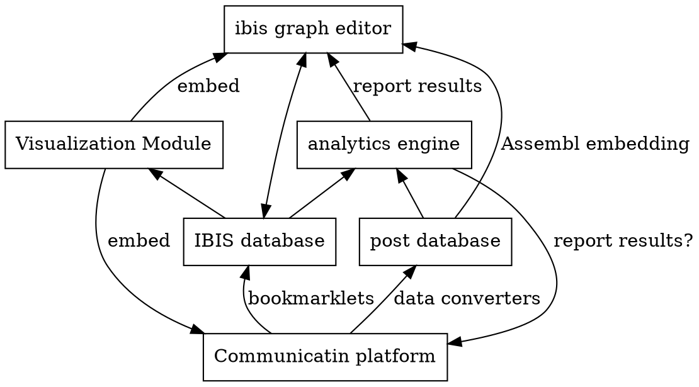

Latex Input: mmd-memoir-header
Latex Input: extra-packages
Base Header Level: 2
Email: maparent@acm.org, benoitg@coeus.ca
BibTex: catalystinterop
MainLanguage: english
Title: Catalyst interoperability operation
Author: Marc-Antoine Parent, Benoît Grégoire
Affiliation: Imagination for people
Latex Footer: mmd-memoir-footer
Latex Input: mmd-memoir-begin-doc
Format: complete

# Prerequisites

This document assumes a basic understanding of the following technologies, which are best described in their respective tutorials.

* REST
* RDF
* Turtle syntax
* JSON-LD
* SPARQL

# Architectural components



# Expected interoperability mechanisms

name technology involved on the bus between any two connected components.
API endpoints would go into another chapter.

## Main communication bus between platforms

### Basics RESTful calls and JSON-LD

### vetted SPARQL queries

### event mechanism (out of scope)

### Example: Platforms and analytics

## Platform and visualizations

### Simple client-side widgets

### Widgets with a server component

### Example: voting

### Deep interoperability with events

# Data model

Location of Ontologies, JSON-LD context, etc.

## Generic ideas

## The IBIS model

```turtle
eg_d1:idea_1 a ibis:Issue;
    dcterms:title "Stop climate change"@eng;
    dcterms:description "A longer description"@eng.

eg_d1:idea_2 a ibis:Position;
    dcterms:title "We should telecommute"@eng.

eg_d1:idealink_2_1 a ibis:PositionRespondsToIssue;
    ibis:response_position eg_d1:idea_2;
    ibis:response_issue eg_d1:idea_1 .

eg_d1:idea_3 a ibis:Argument;
    dcterms:title """Personal transport is a big part 
        of fuel consumption."""@eng.

eg_d1:idealink_3_2 a ibis:ArgumentSupportsPosition;
    ibis:argument_supporting eg_d1:idea_3;
    ibis:position_supported eg_d1:idea_2.
```

## SIOC and containers

## FOAF and users

### Pseudonymization

## SIOC and posts

## Voting

## Tags, comments, etc.

## History

Three levels of support

### Known change types

### Known object types

### Lifecycle events

### Moderation events

### Level 0: Basic event targets

### Level 1: Lifecycle details

### Level 2: Full history

# API endpoints

## The data graph

## The history graph


# Security considerations

## Pseudonymisation support

## Levels of access for tools

## Personal limits to views

## Credential-passing for platforms

## Filtering json-ld?

# Appendices

## Relation to other vocabularies

### IBIS PA

### AIF
