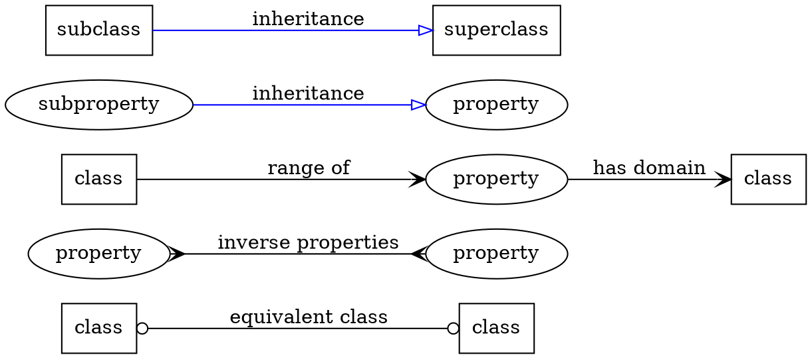
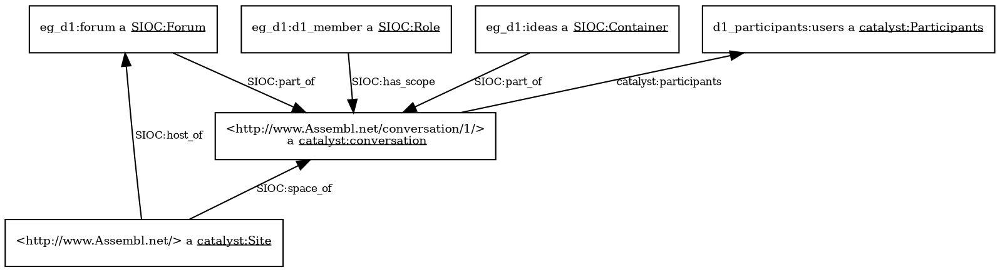
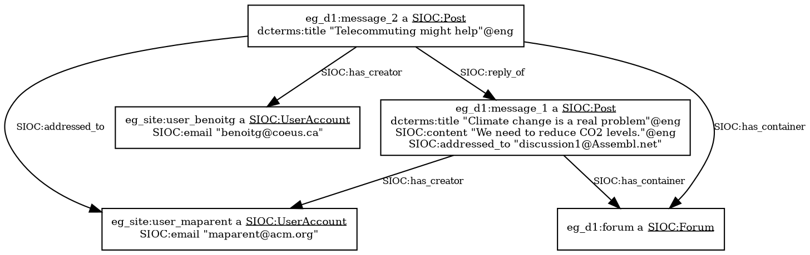
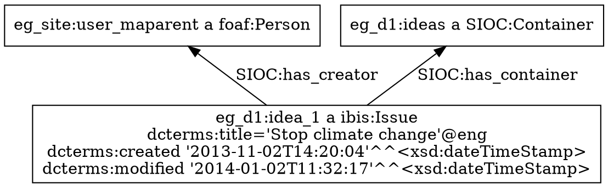
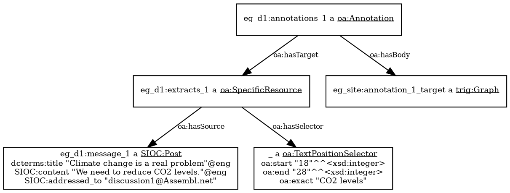
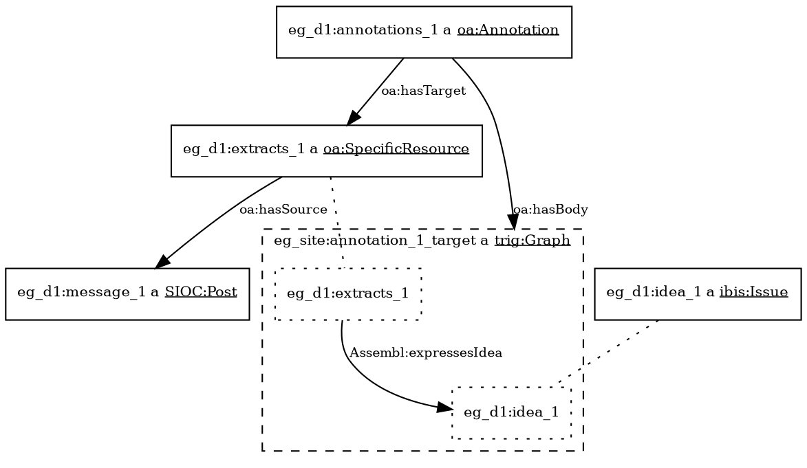
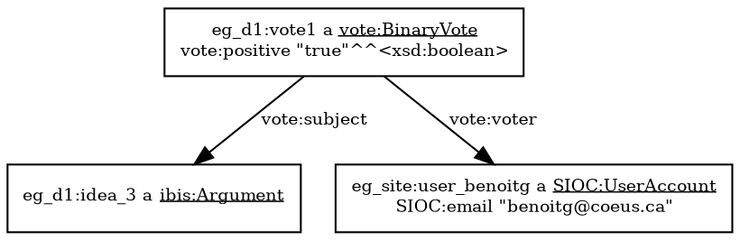
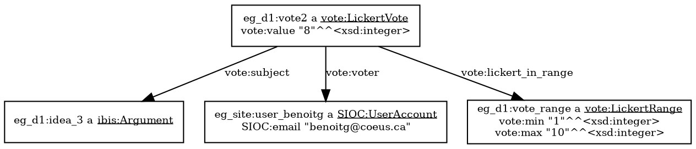

Latex Input: mmd-catalyst-header
Latex Input: extra-packages
Base Header Level: 2
Email: maparent@acm.org, benoitg@i4p.org
BibTex: catalystinterop
MainLanguage: english
Title: Software Architecture and Cross-Platform Interoperability Specification
DocNumber: D3.1
Subtitle: INITIAL DOCUMENT
VersionNo: 0.9
DueProjectMonth: 4
DueCalendarMonth: 1
DueYear: 2014
SubmissionProjectMonth: 5
SubmissionCalendarMonth: 2
SubmissionYear: 2014
WorkPackage: 3
DocStatus: Draft
Author: Marc-Antoine Parent, Benoit Grégoire
html header: <link rel="stylesheet" href="http://yandex.st/highlightjs/8.0/styles/xcode.min.css">
    <script src="highlight.pack.js"></script>
    <script>hljs.initHighlightingOnLoad();</script>
    <style></style>
Affiliation: Imagination for People
Format: complete
Latex Footer: mmd-catalyst-footer
Latex Input: mmd-catalyst-header2

# Context

Online community managers are natural users of specialized CI tools (when they know about them).  However, we do not expect most participants to adopt such tools at the outset.  Their first contact with CI tools will be when they see the tools' outputs, or subsets of their functionality, made directly available on popular Internet social networks and communication platforms.  Interested participants can progressively move to the richer CI tools, and hopefully in time assume leadership roles themselves.

In this model, moderators or participants can directly create structured representations of conversation in integrated CI platforms, or use a CI platform to distil structured representations from contributions made on more general purpose online conversation platforms and social networks (a practice we call harvesting).

The artefacts derived from the structured conversations by the CI tools, such as visualisations, synthesis, reports and attention mediation signals from computer analytics, will be sent back (as content or as references) to the conversation platforms, in the form of messages native to that platform (tweets, emails, Facebook wall posts, etc.).
For communication platforms which have appropriate integration mechanisms, JavaScript widgets can expose richer functionality such as dynamic visualisations, creativity widgets, or voting widgets.

Some participants (or communities as a whole) may choose to migrate to the integration platforms for their richer environment; in general, this should only be a requirement for harvesters and moderators.

# Glossary

CI tool
: Any tool that can be used to enhance collective intelligence, whether or not it is in any way related to this ecosystem.

Catalyst CI platform
: The main platforms from the technical partners of the Catalyst consortium which allow participants to collectively manipulate Concept maps.


Ecosystem component
: Any component accessible by other component through mechanisms defined in this specification.
This includes both Catalyst CI platforms and reusable widgets and visualisations.

Data providers
: Any component with a endpoint serving data defined in this specification.

Data consumers
: Any component using data served by a data provider, through mechanisms defined in this specification

Conversation
: In general, conversations designates a collective process between a set of participants, whereby they exchange ideas. Conversations may be public or private. In the context of this specification, this process defines a unit of data access. Participants to the same conversation are aware of each other's contributions, but not necessarily of contributions to private conversations in which they do not participate. Data consumers' access to data is defined in the same terms, one conversation at a time.

Moderator
: In the context of this specification, designates (collectively) moderators, harvesters, community managers, etc.  It also includes any participant taking on such functions.

Post
: An unstructured contribution to a conversation. This includes posts on social platforms, email messages to individuals or mailing lists, comments to other contributions, etc.

Concept map
: Any decomposition of concepts in a conversation as a structure. 

Generic Idea
: A concept of a concept map that is considered as a unit at a given point in the conversation, when it is represented in the data model defined by this specification.  They are nodes or links in a graph structure (links being generic ideas in their own right), that may have types to refine their nature (arguments, options, etc.).

Contribution
: Designates posts (unstructured) and ideas (structured), contribution units from participants in a conversation.

<!-- 
%Not defined in glossary:

%Dataset vs graph

%(Catalyst) Data Model
-->

# Requirements

## Sharing raw concept maps

Most collective intelligence tools allow organising concepts in some sort of structure that reflects the conversation back to the participants (a concept map in the very broadest sense).
The core of this specification is a Data Model to represent the following in a systems-independent way while preserving as much semantics as practical: 

* The generic ideas of the concept map
* The people interacting with them
* The interactions these people have about the generic ideas (Messages, comments, votes, etc.)

It is critical to share such representations between tools to:

* Develop reusable computer analytics
* Develop reusable computer or human assisted visualisations
* Do research on those datasets

The type and amount of structure can vary greatly between systems, but we believe there are some useful levels of "shared semantics" that are achievable relatively easily. 

The first and most basic level is sharing the raw structure of the concept map (nodes, edges) with very basic information (such as node title).
This allows several visualisation tools to be applied, as well as a significant number of metrics.

The second level is to share more semantics about the nature of the concepts identified.
The consortium agreed that using IBIS (Issue-Based Information System) as a common baseline would foster the emergence of initial tooling.
While it has significant limitations, IBIS is a good choice because:

1. It's widely used by existing collective intelligence software
2. Many systems not using IBIS could transform at least a subset of their data into meaningful IBIS.

## Re-usable analytics

Analytics vary greatly, but all will take data from the Data Model defined later, perform some computation and return either:

1. Structured data for further computation, transformation or visualisation.
2. Visualisations (possibly interactive) or reports directly usable by a human 
3. Attention mediation signals to be processed by some deliberation environment to focus a user's attention to a section of the conversation where something interesting happened.

## Re-usable visualisations

Visualisation here is understood in a broad sense:  any transformation of raw data to present a final representation more understandable to humans.

Some are static (images), some dynamic (widgets).
Some allow entering additional data to enrich the visualisation, or navigating the concept map.
All re-usable visualisations need to be shareable on the wider Internet for maximum impact (social networks, emails or sometimes even print).

These components take as input one or both of:

* Some subset of a the Data Model
* The results of analytics

The form of those inputs, and how to transmit them to the visualisations is covered by this specification.

Once it has the data, the visualisation can optionally:

* perform some transformation or filtering of the data
* gather additional data from a human in its interface (e.g.: select a variant of the visualisation, have a human add textual context to the data, etc.) or use a data subset previously specified in a specific CI tool.
* contact one or more remote servers for processing or to get additional data

If and how a specific visualisation does so is an implementation detail that is outside this specification.

Finally, the visualisation generates one or more final outputs, in a format, appropriate to the nature of the output, that can be made directly available on the web.
This is covered by this specification.

"Re-usable" Visualisation here means that:

1. The code of the visualisation can be directly re-used by any system providing the data meant to be visualised in the Data Model defined by this specification.
2. That the final output of the visualisation (typically:  a URL to an image, an embeddable web widget, a downloadable pdf, etc.) can be displayed easily outside the context of the system that runs the visualisation code simply by linking a URL or including an iframe or a small piece of JavaScript as appropriate.
3. That the visualisations is self contained.  For example, when used as a widget if it displays a menu, it should only contain the elements necessary to exploit the specific visualisation, not the complete menus of it's parent application (if there is one).


## Re-usable interactive widgets

Many components of the purposed ecosystem can be isolated and shared within platforms. 
One example from the field of Collective Intelligence that is quite mature is voting; how to avoid many common voting biases is well known in academia, and has been for years. However, reusable voting tools haven't been made widely available on the Internet.

Making such tools (voting, ideation facilitation, collective action, etc.) available online, in reusable form, is one of the goals of this effort.

The difference between this and the visualisations above is that these widgets always store data of their own to some back-end, and manipulating this stored data is expected to be done by end users (not moderators, harvesters, etc.).

The main problem here is not the lack of standards, but the number of incompatible standards which are not widely deployed.  
One actually has direct applicability, and some significant traction:  [OpenSocial](http://opensocial.org/).
Sadly, the tooling required for its deployment is significant, and quite probably overkill in our case.

This specification will take a pragmatic approach, to attempt to at least provide a common denominator that is sufficient for our narrow field, technology independent, and allows the minimal number of requirements for sharing CI widgets OUTSIDE the ecosystem (on web forums, web sites, social networks, etc.)

## Obtaining and representing raw contributions from messaging platforms

A variety of tools and social networks allow participants to exchange messages on the Internet.
Sadly, they are all in different formats, making the use, reuse and analytics of this data needlessly painful.
The catalyst ecosystem agreed to standardise on SIOC (Semantically-Interlinked Online Communities) as a data model, and will write tools to make several other formats available as SIOC.
This way, analytics and annotation environments have only one format to process. 


# Architectural components

```graphviz 0.49
digraph g {
    graph [bgcolor="transparent", rankdir="TB", compound="true"];
    node [fillcolor=white, style=filled,  shape=record, fontsize=9];
    edge [fontsize=8];
    subgraph cluster_catalyst {
        graph [rankdir="LR", label="Catalyst Collective Intelligence Platforms [I O Z]", fontsize=10];
        subgraph cluster_front-end {
            graph [rankdir="TB", style="dotted",
                label="front-end", fontsize=10];
            display1 [label=<Display widgets<br/>&amp; documents>];
            internalUI[label=<Internal UI, map editors, etc.>];
        }
        annotation [label="Web annotation services [O I]", style="dashed"];
        database [label=<Databases<br/>Generic ideas, comments,<br/>messages, users<br/>internal data...>];
    }
    subgraph cluster_components {
        graph [color="transparent", rankdir="LR", label=""];

        analytics [label="Analytics [Z]"];
        viz [label="Reusable Visualisations [O I W]"];
        widgets [label=<Reusable CI widgets [I O]<br/>voting, pledging, creativity>];
        viz_db [label="Visualisation back-end & storage", style="dashed"];
        widget_db [label="Widget back-end & storage"];
        SIOC [label="Post to SIOC converter [I]"];
    }
    subgraph cluster_external {
        graph [color="transparent", rankdir="LR", label=""];
            subgraph cluster_comm {
                graph [color="black", label="Social & messaging platforms [I W]", fontsize=10];
                subgraph cluster_msg {
                    graph [label="Messages"];
                    display2 [label=<Display widgets<br/>&amp; documents>, style="dashed"];
                }
            }
            subgraph cluster_web {
                graph [color="black", label="Web page", fontsize=10];
                    display3 [label=<Display widgets<br/>&amp; documents>, style="dashed"];
            }
            subgraph cluster_dash {
                graph [color="black", label="Dashboard [O I]", fontsize=10];
                    display4 [label=<Display widgets<br/>&amp; documents>];
            }
    }

    # data links
    analytics->viz;
    analytics->internalUI [lhead="cluster_catalyst"];
    database->analytics;
    database->viz;
    database->widgets;
    SIOC->analytics;
    SIOC->database [lhead="cluster_catalyst"];

    analytics->display2 [label="attention mediation", lhead="cluster_msg", color="blue", fontcolor="blue"];

    # viz links
    edge [color="green"];
    viz->display1;viz->display2;viz->display4;
    widgets->display1;widgets->display2;widgets->display3;

    # unspecified
    edge [color="orange"];
    display3->annotation [ltail="cluster_web"];
    internalUI->database [ltail="cluster_front-end", dir="both"];
    viz->viz_db [dir="both"];
    widgets->widget_db [dir="both"];
    display2->SIOC [ltail="cluster_comm"];

    # fake links
    edge [color="transparent"];
    #database->analytics [ltail="cluster_catalyst",lhead="cluster_components"];
    #viz->display3 [ltail="cluster_external",ltail="cluster_components"];
    display4->display2->display3;
}
```

This is a view of components, and their expected interactions. Letters represent catalyst technical partners expected to develop at least one such a component. Links in green represent visual widget embedding. Links in orange are implementation specific, and outside of the scope of this specification. Dashed boxes are optional for any given implementation.


Catalyst Collective Intelligence Platforms
: These are the general web platforms that users interact with that fully exploit the data model: they include Open University's DebateHub, IP's Assembl, MIT's Deliberatorium.

Databases of Catalyst platforms
: These databases, in the back-end of the catalyst platform, hold the deliberation data: Users, concept map, comments, etc. Some of that data will be made accessible to other services and widgets through RESTful and SPARQL endpoints, defined below.

Front-end of Catalyst platforms
: The user-facing side of each catalyst platform will be tied closely to its respective database, and specifying that interaction is a non-goal. However, it will integrate information from other services, either as (Pulled) json data, or as embedded widgets.

Internal UI, map editors, etc.
: Some web components will be part of the front-end of their platform, and will not be reusable.

Web annotation services
: Some platforms integrate with services (bookmarklets, browser extensions etc.) that allow to clip quotes from web pages and integrate them into the platform datasets.

Reusable Collective Intelligence Widgets (creativity, visualisation, voting, etc.)
: Embedded Widgets are pieces of user-facing Web code that can be embedded in another platform. They may be static JavaScript that talks only to the back-end of the process it is embedded in, or it may need to communicate with its own *Widget back-end & storage* component.

Reusable Visualisations
: These are dynamic web views which generate static or dynamic visualisations of the concept map or social graph, but not to edit it. Some of those may be a simple snippet of HTML and JavaScript, some may have their own *Visualisation back-end & storage*. In either case, they will be designed so they can be embedded in catalyst platforms, and maybe some social and messaging platforms, or even web pages.

Social and messaging platforms
: These are existing social and messaging platforms where users can post messages, such as email, Facebook, twitter, blogs, etc.
This also includes some CMS used by our partners, such as Drupal for Wikitalia or Utopia.de for Euclid.
How deeply they can integrate catalyst services (e.g. widgets) depend on their facility for integrating plugins.

Post to SIOC converter
: Converter components will extract messages (and attendant social graph information) from the social and messaging platforms and expose them as SIOC data to other components, including analytics, visualisation, voting services and the catalyst platforms.
Note that this means the user graph may be distributed between many databases (Such as Catalyst databases, Post converter, and Voting services with their own storage.)

Analytics services
: The analytic components will extract data from the various databases and supply analytic results back to various components. It will also be the origin of some attention mediation messages that will be fed back into the messaging and social platforms.

Voting services
: Voting is a good candidate for reusable components: We can define votes in a platform independent fashion.
Each voting component would define voting values, store them in their own databases, and provide appropriate aggregates to other components. It needs to access data from the Catalyst platform to identify the voting users and the voted ideas.

Dashboard
: A web page that can display results from visualization and analytics tools to give an integrated view of the conversation, independent of the main CI platforms.

# Interoperability mechanisms

<!-- %name technology involved on the bus between any two connected components.
%API endpoints would go into another chapter.
-->

Components that perform processing (visualisations, analytics, vote, etc. including some components that are part of the integrated catalyst platforms) will expect to get data from other components. 
For example, visualisation components might want to display various nodes of the generic idea dataset with a size proportional to votes, or to per-node activity levels provided by analytics. 
An important part of the specification will thus concern the means by which components can request data from each other, and the format of that data.

Other parts will concern integration of visual components in catalyst CI platforms, web forums, social networks and web dashboards.

## Data access

### Prerequisites

This part of the document assumes a basic understanding of the following technologies, which are best described in their respective tutorials.

* [REST](http://rest.elkstein.org/)
* [RDF](http://www.w3.org/2007/02/turtle/primer/)
* [Turtle syntax](http://www.w3.org/TR/turtle/)
* [JSON-LD](http://JSON-LD.org/spec/latest/JSON-LD/)
* [SPARQL 1.1](http://www.w3.org/TR/SPARQL11-overview/) ([tutorial](http://www.cambridgesemantics.com/semantic-university/SPARQL-by-example))

### Levels of data access
An explicit goal of this specification is that a third player can offer a new component that will interoperate with the other components of the ecosystem, without the other components needing to adapt to the new component.

A simple read-only access to the data should be adequate for many analytics and visualisation purposes, and some partners may choose to implement this simple access method.
Other components will need richer access to write to the data model, quickly get subsets, aggregates, updates, etc.

Data consumers should be expected to access the data through one of the following mechanisms (choice of mechanism and endpoints to be part of configuration parameters):

1. Pulling all server data relative to one unit of conversation in a single request as JSON-LD (*MANDATORY*).
This is the minimal plumbing required to participate to the catalyst ecosystem.
If a given platform server can host many different conversations with disjoint communities, is is expected to offer an endpoint for each, as each may define different access permissions.
2. Exposing a coherent subset, defined on the data server, to a consumer at a provided (opaque) URL.
3. Endpoints allowing to access the collection of each main type of resource, optionally with some filtering ability (GET endpoints)
4. Read-only SPARQL Endpoints with agreed queries.
5. Read/write RESTful endpoints for the collection of each main type of resource
6. Read/write SPARQL endpoints.

As a system makes more sophisticated access methods available, it can expect better services from the ecosystem.

Note that some of the social platforms we plan to integrate with do not offer RDF data at all.
The conversion of some of this data to RDF may be done within the scope of this project, but designing a generic way to do so is outside this scope, and is well handled by such known technologies as [GRDDL](http://www.w3.org/TR/grddl-primer/).
Similarly, though some platforms (notably Drupal) will expose their data in RDFa, this still requires a crawling step and Catalyst tools are not expected to implement this themselves.
In the specific case of Drupal, we recommend installation of the [SPARQL module](https://drupal.org/project/SPARQL), or at least the [RESTful Web service module](https://drupal.org/project/restws).

In particular, a third player offering a new component cannot expect endpoints tailored to the exact subset of data it requires, and it may have to receive more data than it needs for its purposes.
The RESTful endpoints thus err on the side of being exhaustive, as opposed to efficient.
Efficient, targeted requests may be defined in SPARQL, but not all catalyst components will offer generic, open SPARQL endpoints; and some authors of new components may not be familiar with SPARQL and RDF.
Thus the choice of RESTful, JSON-LD endpoints as lowest common denominator.

### RESTful access endpoints

Most client components will want to interact with the data on the platform, and this will usually be done through RESTful read endpoints (option 3 above), one for each conversation unit and meaningful collection of resources, as defined later in [Endpoints and configuration][].
A small subset of these endpoints will also provide full CRUD access (an example is given in the voting section.)

#### What you have to know about RDF while using JSON-LD

JSON-LD is meant to mostly look like just another JSON format, where many dictionary values are valid URLs which specify where you can get more information about a given resource.

In many cases, it can be used by developers just like any other json document.
However, there are a few pitfalls.

*Inheritance*: the `@type` argument in JSON-LD corresponds to a RDF class.
It may be a subclass of the RDF class you expect.
Similarly, every property may be a sub-property of the RDF property you expect.
The JSON-LD `@context` will give you the ontology specifications; a RDF database can use the ontologies to answer SPARQL queries specified using known super-classes. 

However, one goal of this specification is that tools should be able to participate in the ecosystem without RDF machinery.
So compliant data providers SHOULD give multiple values for the `@type` parameters when appropriate, so that at least one comes from the catalyst classes specified in this document.
However, since there is no syntactical support for multiple property names directly in JSON-LD data, external tool developers should avoid introducing sub-properties that are not part of this specification.

*Inverses*: Some RDF properties define inverses: for example `SIOC:creator_of owl:inverseOf SIOC:has_creator` (in other words, the fact that some user is the author of a Post in SIOC can be defined inside the Post object, or inside the user account object).
Some of those inverse are not specified in the ontology, such as `dcterms:isPartOf` and `dcterms:hasPart`. (We will define a sub-property to specify this.) The list of such inverses is short, and will be provided as an annex of this specification.
<!-- %TODO:  Write annex... -->
Tools that receive JSON-LD from a catalyst platform are expected to interpret either of those relationships as implying the other.

<!-- %TODO: specify a sub-property of hasPart -->

*Multiple identity*: A given object may be identified by multiple URIs.
This would be marked with `owl:sameAs`. 

#### Aggregates and individual resources

In accordance with the general principles of linked data, each resource's IRI should ideally be dereferenceable as a URL.
However, this will rarely happen: Most client applications will prefer to access aggregates of resources, to minimise queries.
This requires those aggregates to also be named resources. 
These resources may also correspond to RESTful endpoints, when those exist.
Also, from a RESTful point of view, aggregates need to exist as target to PUT operations when required.

### Trusted or vetted SPARQL queries

Some platforms that have this capacity may allow trusted client tools (e.g. analytics, visualisation, or voting modules) to make SPARQL queries or even updates directly against their database, as opposed to loading the whole object graph or navigating it in successive REST requests.
This obviously allows for more efficient partial requests, in a way that can be independent of the specificities of the underlying private model of each platform.

The best way to implement this would be to use a native RDF database such as [Jena](https://jena.apache.org/) for development.
However, most technical partners already have data in relational database.
To expose this data through a SPARQL endpoint, the main options are either: 

1. Use a hybrid relational-semantic database such as [Openlink Virtuoso](http://virtuoso.openlinksw.com/) with its [linked data views](http://docs.openlinksw.com/virtuoso/rdfviewsrdbms.html).
This approach has been chosen by IP for Assembl.
2. Use tool that can expose a relational database through a SPARQL through a correspondence specification, such as [D2RQ](http://d2rq.org), or [Antidot](http://www.antidot.net)'s [db2triples](https://github.com/antidot/db2triples/), which is based on the W3C standard [R2RML](http://www.w3.org/TR/r2rml/).
The disadvantage of such translation layers is that they will have poorer performance than a native SPARQL database.
3. Take snapshots of the relational database (probably using a JSON-LD view, as defined above) and feed it to a native RDF database.
This has the downside of being less timely, but may be less resource-intensive than the previous option.

In a broader ecosystem context, most platforms would not open the SPARQL endpoint to untrusted external tools, if only to avoid denial of service attacks using complex queries.
However, a platform may choose to expose a subset of pre-defined SPARQL queries to unknown tools, and tool builders may propose useful SPARQL queries to platform builders.

## Endpoints and configuration

Though it should be possible to develop new components in the ecosystem without modifying the code of other ecosystem components, each component will have to be made aware of other components through configuration. 
Each component will have its own configuration mechanism, and it is not a goal to normalise configuration formats, but it is a goal to specify which information needs to be included in the configuration to enable interoperability.

Basically, any component (including catalyst CI platforms) that has to push to or pull from another component needs to know about that component's available endpoints.
This initial configuration will take the form of a dictionary (JSON-LD or even plain JavaScript object) with the URL of endpoints given for any defined endpoint type. This initial configuration data may be passed as value or as a URL reference, and may be a static file for a given component.

The configuration for any server component (especially platforms) can include the following:

1. A global read REST endpoint returning a self-contained JSON-LD of all data that is to be made available to the other component.
2. A opaque URL returning a self-contained JSON-LD of coherent subset, defined on the data server.  For example: For a specific subset of generic ideas, the comments if any should be included.
3. provide read (or optionally read/write) endpoints for each major data type.
4. provide the URL of a read-only (or read/write) SPARQL endpoint.

Either of 1 or 2 is mandatory, 3 and 4 are optional.

The platforms may elect to provide rich endpoints, with full create/update/delete features, and filters as query arguments. 
Query filters, in particular, are not part of the specification and not expected.

The list of endpoints other than the global endpoints is meant to correspond to meaningful subsets of data, notably:

For interoperability purposes, we need to refer to many collective entities as a whole, notably:

1. The notion of conversation: the set of all interactions that a community has around a topic.
2. The collection of all generic ideas and their links in a conversation
3. The information relevant to users in a conversation (with controlled access)
4. The collection of posts, i.e. contributions to the conversation that are not part of the graph of generic ideas: References, comments, etc.
Those will be grouped according to the origin of those contributions.
5. The set of those contribution origins: sources such as social media, mailing lists, etc.
6. The set of interaction history.

So the most minimal, static view of the data for one conversation (which we define as the unit of data access, and some servers may have only one such unit) could be as simple as this:

```json
{"conversations":[{"fullDataService":
    "http://catalyst.platform.server/api/conversation/1/all-data/"}]}
```

A given widget may also recieve a dynamic subset by reference, like this:

```json
{"conversations":[{"dataSelectionService":
    "http://catalyst.platform.server/api/conversation/1/datasubet/widget0336"}]}
```

But a full-fledged server's configuration could look like this. Note that the keys of a conversation dictionary are agreed upon, but the URLs are expected to be opaque. More important, all the endpoints except the first are optional, and may be omitted even if they are meaningful for your platform.

```json
{
    "@context": "http://purl.org/catalyst/jsonld",
    "users": "http://catalyst.platform.server/api/userinfo/",
    "conversations":[{
        "@id": "http://catalyst.platform.server/api/conversation/1",
        "@type": "Conversation",
        "fullDataService": "http://catalyst.platform.server/api/full_data/",
        "ideasService": "http://catalyst.platform.server/api/conversation/1/ideas/",
        "usersService": "http://catalyst.platform.server/api/conversation/1/users/",
        "messagesService": "http://catalyst.platform.server/api/conversation/1/messages/",
        "messageSourcesService": "http://catalyst.platform.server/api/conversation/1/sources/",
        "votesService": "http://catalyst.platform.server/api/conversation/1/votes/",
        "historyService": "http://catalyst.platform.server/api/conversation/1/history/",
        "SPARQLService": "http://catalyst.platform.server/SPARQL/"
    },
    {"@id": "another conversation..."}
    ]
}
```
<!-- %TODO: Adjust ontology accordingly -->

This would expose endpoints for most of the server's data, but the components will also have to agree on appropriate levels of data access. 
We propose that this should be done through the platform defining a pseudo-user for the component, with the appropriate permissions.
The component will have to be configured to identify itself with the appropriate pseudo-user and password, using OAuth over a secure channel.
This requires that the platform either acts as a OAuth server, or uses an external one.
In some cases, it may be necessary for the platform to assign a user to the component at runtime, rather than at configuration time; this will be specified later if necessary.
Also, in some more complex cases, the component may want to assign a permission level to the platform, and the interaction will then have to be reversed.
Again, we will specify this symmetric case if the need arises.

## Analytics processing

Catalyst platforms will request the analytics to perform long-running calculations.

The URL may be protected by some form of access control, such as an access token, if necessary.

At this time, we foresee that these will be short enough (minutes) to be covered by synchronous requests.  Components exploiting these results are expected to do any caching necessary to share and deliver them to other components or end users.
If that turns out not to be the case, it may be necessary to specify an asynchronous communication model for analytics.

### Batch requests

The most common usage scenario involves a batch request from a catalyst platform to an analytics server.    
<!-- %I still think the most common scenario is a synchronous call, with caching a concern of the client --> 
In the simplest case, the catalyst platform would POST to the analytics server a request with relevant data (which may include a JSON-LD payload, or the URL of endpoints whence such data can be pulled); the analytics platform would respond with an URL to the analytics computation results.

### Continuous analytics

Another usage scenario involves an analytics engine watching over the changes in a Catalyst deliberation platform.
In the most general case, this requires intimate knowledge of the requirements on both ends and will not be standardized.
However, the most common case of attention mediation events could be defined.
In either case, the history events would be pulled from the catalyst platform by the analytics engine as a flux.
(This may still be a RESTful endpoint, or a more traditional socket if timeliness is an issue.)

In the specific case of attention mediation, data payloads (or URLs to data) could be posted by the analytics platform on an agreed upon endpoint in the catalyst platform.
The issue of translating those payloads to human-readable messages is non-trivial, since the catalyst integration platforms are the ones which are aware of the participant's functional languages.
Ideally, both platforms would agree on a vocabulary of attention signals, and the localization of those signals would be performed by the catalyst conversation platform.

## Platform and visualisations

One of the end goal being to allow embeding of the visualisations in outside platforms, we will need to balance forward thinking and flexibility with ease of implementation, browser compatibility, and pragmatism.

Instead of trying to find (or worse, define) a universal standard, we will define a variety of means to achieve varying levels of support.  Some new techniques are emerging, and we expect this field to change significantly during the 2 years of the initial catalyst project.

### The capabilities of the system where may we want to share visualisations and widgets

Various systems on the Internet have various levels of capability.  Those are listed in order of increasing sophistication.

#### Systems only allowing text

While these systems may allow attaching images, hyperlinks or videos, they give very little formatting control (no HTML at all).  Examples include plain text email and Facebook posts.

Any visualisation or widget that want to be exposed there is limited to a hyperlink, a textual description and perhaps a thumbnail.

The hyperlink can point to the representation is available (typically on a Catalyst CI platform).

#### Systems allowing static HTML

These systems, by configuration or technical limitation, offer more or less limited html formatting, and normally no JavaScript or iframe.  Examples include many forums, Content Management System and HTML email.

Any visualisation that want to be exposed inline must have a static version.  However, typically several hyperlinks and buttons can be included in the representation.

The hyperlinks can point to a specific section, or a specific action on the representation on the web (typically on a Catalyst CI platform).

#### Systems allowing IFRAME tags or JavaScript embedding

These systems offer more or less limited html formatting, and allows either (or both) JavaScript or an iframe HTML tag to be included in a message or page.  Examples include many forums, Content Management System and wikis (is so configured) and most generic web sites.

This is the first level that allows inline interactive visualisations.

Any visualisation that want to be exposed inline must be able to be wrapped in an element (typically an iframe) of unknown size.  

#### Systems designed to display widgets

These systems include facilities for displaying reusable web components as part of their design.
Examples include many portlet and dashboard servers such as Liferay, enterprise social networks, some Content Management Systems, and some Catalyst CI platforms.

Reusable visual components that can be used across web sites is an old technical requirement, and the Web is riddled with different incompatible ways to partially fulfil it.
This can be done using [W3C Web widgets](http://www.w3.org/standards/techs/widgets) or maybe the emerging [W3C Web components](http://www.w3.org/TR/components-intro/), as described [here](http://www.html5rocks.com/en/tutorials/webcomponents/imports/).  [OpenSocial](http://opensocial.org/) is quite popular on enterprise social networks and some portal platforms.

Depending on the specific capabilities of this system, this is the first level that allows communication between widgets, access to user data and single sign on for the user of the hosting platform, and various other capabilities.

#### Systems that allow creating custom modules

These systems include facilities to internally run code to extend their functionality in various ways.  Example include most Open Source Content Management Systems.

This typically allow all the capabilities above, but at the price of writing code specific to the system.  This can still allow significant reuse is the platform is very popular (e.g.:  Drupal, WordPress)


### Fully client-side widgets

The simplest widget is a purely client-side visualisation widget, simply a snippet of HTML with JavaScript.
Such a widget would need to receive a configuration from the platform, giving the initial REST and/or SPARQL endpoint; it would then process the object graph from that endpoint.

#### Example widget

So, for example, a simple client-side widget that wanted to display the social graph using [D3](http://d3js.org) would go through the following steps:

1. The Catalyst platform would obtain a snippet of HTML including JavaScript requirements and the name of an initialization function.
2. It would insert the HTML snippet in an appropriate `div` element.
3. It would call that function with the main endpoint to the catalyst platform.
4. The widget code would use it to obtain the endpoint(s) to the user and message data graphs.
5. It would then obtain the user and message data through those endpoints.
6. It would convert the JSON-LD data obtained into another data format that is expected by the visualisation libraries.
(A library such as [Stapling](https://github.com/WelcomWeb/Stapling) may be useful for generic JSON transformations.)
7. Finally, it would insert the graph in the HTML snippet.

### Widgets with a server component

A different scenario would involve a server component, which could receive a request on a known endpoint, and return visualisation data.
The server would have to get the graph data that is to be visualized: either the JSON-LD graph could be part of the request, or the location of a REST or SPARQL endpoint on the platform server where the visualisation server could get the data.
This raises classical cross-origin data issues: If the widget code is hosted on the visualisation server, it would require an authorization token to access the platform data, and vice-versa.

In the simplest case, the server would simply return an image; in some more elaborate cases, the visualisation widget would have its own HTML snippet and attendant JavaScript to lay out and interact with the visualisation data.
The best practice involves sending back a shareable URL where the image or HTML can be retrieved by other components.
Those problems have known solutions.

### Voting widgets

Voting widgets are a fairly complex example, because unlike most other widgets they affect the common data model, as opposed to many other components whose results are more independent.
For that reason, going through the interactions expected of a reusable voting component illustrates the more complex workflow possible in this architecture. 
This is intended to be a full example, and therefore fairly complex; most components would only need a subset of this interaction.

0. As part of the Catalyst platform's configuration, there will be an endpoint to a voting component. The catalyst platform will send a message to the voting component with initial configuration.
1. The voting component will receive a basic RESTful endpoint for one of the catalyst integrated platforms. From there it would obtain each collection's endpoint.
2. It would use those other endpoints to obtain the generic idea dataset and pseudonymised user graph from the catalyst platform.
3. Optional: It may be directed to obtain the pseudonymised user graph of a social platform separately, through the endpoint of a Message-SIOC converter. That step is unlikely, as the social user graph will often be cached by the catalyst platforms.
4. Optional: Configuration information sent to the voting component may have information about user groups or roles that are allowed to vote. (Those groups will otherwise be opaque SIOC entities from the voting platform's standpoint) (This configuration information would have to be defined at a later stage.)
5. Voting will have to convey to the catalyst platform which of the types of  voting information it expects (boolean, lickert or ordering) and the catalyst platform will provide an appropriate representation. This information could also be part of the catalyst configuration.
6. User action in the snippet will trigger a `POST` action with the voting information (in JSON-LD) on an appropriate RESTful endpoint set in the configuration.
    * This endpoint will usually be part of the voting component service, which will store votes itself.
    * In a catalyst platform with full read/write SPARQL endpoints, the catalyst platform could store the voting data itself, if configured to do so. This limits the applicability of the voting service to a subset of catalyst platforms; but it also simplifies the design of the voting component. We expect the balance of costs and benefits to favour the first option.
7. On demand, with appropriate configured endpoints, the voting component can provide raw voting information to the catalyst platform. (Or vice-versa if the Catalyst platform stores the voting information.) The voting information will be a separate SIOC collection.
8. On demand, with appropriate configured endpoints, the voting component will provide aggregate voting information to the catalyst platform. The interpretation of this information is not yet specified, and in general it will depend on an agreement between components. However, some aggregates will be defined in a subsequent version of this specification, as we discover the most common usage patterns.
9. On demand, with appropriate configured endpoints, the voting component will provide visualisation of aggregate voting information. This will use the usual visualisation widget interface as defined above.

### Deep interoperability with events

In the most complex case, the widget would not only read the platform's data model, but also allow to edit it, or at least to tell the platform front-end about a user action initiated in the widget, such as node selection.
This requires deep interoperability between the widget and the platform, presumably through sharing high-level change events between the widget and the platform.

There are two ways to do this: The widget front-end may either communicate directly with a rich platform front-end, or indirectly through endpoints on the platform back-end. 

Let's first examine contact through the back-end: this can be done easily through RESTful editing commands on the data itself (POST and PUT), or through POSTing high-level user events (node selected, etc.) that would correspond to those stored in the audit history.
The advantage of that approach is that it uses mechanisms we have already defined, and that it can work even if the widget is displayed on another web page somewhere on the internet;
the disadvantage is that, in most architectures, it is difficult for the platform server to push changes back to the platform front-end. (Assembl being an exception.)

The other option is for the widget front-end to exchange those same user events with the platform front-end.
The advantage is that the widget front-end needs to understand less about the platform back-end endpoints;
the disadvantage is that event passing between web components has not yet been standardized properly.
We are left either with:

* completely ad-hoc solutions, where the widget and front-end would document the elements and JavaScript events that can be sent to them.
* structured architectures such as [Aura](http://aurajs.com/), that are light to integrate (no server component) but are unlikely to be already used on integration platform unless its UI is already widget based.
* solutions that are heavily dependent on a specific front-end framework such as [Marionette](http://marionettejs.com/)
* heavy architectures such as [OpenSocial](http://opensocial.org/).

The main problem is that unlike the reusable widget case above, both the existing integration platfom's front-end AND the widget must pick the same standard for all widgets (bot internal ones and reusable ones).

This is going to be an area of further exploration for us before we commit to a choice.

## Analytics intermediate results and attention mediation

We expect a great variety of analytic tools to be developed, but though we aim to standardize how the analytics platform can obtain data from the catalyst conversation platforms, the specific utilization of the analytics output by these platforms will be intimately tied to either the conversation platform itself or one of its visualisation.
For that reason, it is not a realistic goal to standardize an exhaustive list of possible analytic semantics, and maybe even syntax.
The utilization of analytics data will always be mostly ad-hoc.

However, some basic principles can be agreed upon: First, analytic results should refer to resources by their RDF identifier; second, we could develop a syntax for the most common cases, based on JSON-LD; and third, we have to agree on basic API endpoints.

A common case of analytics for sending intermediate results is to "annotate" the nodes of the concept map with aggregate values. Those aggregate values can be expressed as RDF properties from a closed vocabulary. A document will be written that documents the meaning of each of those properties, with their JSON-LD name. The JSON-LD document would follow this structure:

* node (GenericIdea, User, Post, etc.)
    * metric_aggregate_name (e.g.:  NUM_COMMENTER, 
        NUM_DIRECT_COMMENTS, NUM_TOTAL_POSTS, LEVEL_OF_DISAGREMENT)
        * value (typically a scalar value, 
        but may be a structure, such as a list of participants)

The meaning of aggregate names and format (and interpretation) of the value, for metrics that do not provide their own visualisations, is done through shared knowledge.
A metric will typically generate more than one aggregate per node.
Definition for common metrics will eventually be listed in an annex to this specification. 

### Attention mediation
The case of attention mediation deserves special mention, because it is expected that the end user will receive actual notifications by email, or in some user interface of a catalyst integrated platform.
The actual text of this notification depends on information only the integrated platform can realistically generate:  URL where the user can/should take action, language the user speaks, context of the notification (summarizing the context, such as a description of the nodes), the user's real name and email address, etc.

We will have a closed vocabulary (using SKOS or some other means) of attention mediation message identifiers, and another vocabulary of reasons while a given message is sent to a given user. A message will consist of a recipient (User), topic (a Generic Idea), mediation message, mediation reason, and possibly signal strength.

To avoid repetition, The JSON-LD file might group data by topic, or topic and message. The structure would be close to this one:

* topic: (GenericIdea)
    * message: ATTENTION_MEDIATION_VOTE_MAJORITY_CHANGE
        * strength: (In this case 0 or 1)
        * target: (User); mediationReason: VOTED_FOR_IDEA
        * target: (User); mediationReason: CREATED_IDEA
    * ATTENTION_MEDIATION_INCREASING_CONFLICT
        * strength: (In this case a value between 0 and 1)
        * target: (User); mediationReason: VOTED_FOR_IDEA, POSTED_ON_SUB_IDEA 
    * ATTENTION_MEDIATION_RENEWED_ACTIVITY
        * strength: (In this case a value between 0 and 1, probably a function of the number of duration of the dip in activity * recent posts/total posts)
        * target: (User); mediationReason: VOTED_FOR_IDEA, POSTED_ON_IDEA 

The catalyst integrated platform will decide if, how, and how frequently it will notify the user for each attention mediation.

## Unspecified interactions

Some interactions between components will not be the subject of specification, because they are self-contained, highly specific and knowledge of their internal function is not useful to the ecosystem as a whole. Those include:

1. Importation of messages from the server platforms to the message database. 
The output of that operation needs to follow this specification, but its process is self-contained.
2. Client-server interactions in complex visualisations: There are too many different ways to do this to impose a single one.
3. Asynchronous visualisation tasks: The specifics can be handled by an appropriate widget.
4. Quotes: Importation of quotes into the comments database may vary. The resulting quote data will be made in OpenAnnotation, as described later.
5. Graph edition: Each platform will implement its own mechanisms for communication between front-end and back-end, such as edition of graph data.
In general, such mechanisms tend to be tightly coupled to the internal data model.
Trying to agree on this is possible, but probably too much effort for the real benefits.
6. Configuration mechanisms: Each platform will have its own configuration mechanisms. Endpoints will have to be normalized, of course.

# Security considerations

Though members of the Catalyst consortium have mostly worked with public conversations, we may have to deal with private conversations and we must ensure that our APIs do not open the door to unauthorized access.
In general, access control will be granted to tools on a per-conversation basis.

## Pseudonymisation support

In particular, the Catalyst project has an obligation to ensure that personal information is not transmitted without consent.
As large parts of our project deals with social network analysis, this is a non-trivial requirement.
One safe route would have been to only deal with public forums, where there is no assumption of anonymity.
That said, some of our communities are involved in ongoing conversations, and have not signed research agreements beforehand, and we have to do the best we can to guarantee their privacy against at least the most basic attempts at re-identification.

To that purpose, the various platform should be able to provide each tool they deal with pseudonymised data, that is data where the user identity is replaced by an opaque identity.
This conversion must have the following properties:

1. It must be identity preserving, in that two ideas with the same author should be marked as belonging to the same pseudonym.
2. It must be reversible: if an analytic tool identifies someone as central in the social network, the platform should be able to identify the original user account.
3. It must not leak personal information (name, email, etc.)
4. The pseudonyms should vary by conversation unit.
In particular, if the same user account is used in a public and private conversation on the same server, it should not be possible to tie those accounts together using the same pseudonym.
5. Similarly, if two tools are given data different views of the data on the same conversation with different degrees of access to personal information, they should not be given the same pseudonyms.
This is only a consideration if we distinguish an intermediate level of access to personal information between "full access" and "no access"; this is very unlikely to be worth the added complexity.

Analysis tools must be granted access to APIs with a key that gives them access to certain conversations at a certain level, and not other conversations.
On the other hand, the front-end of each platform will need access to at least some information about other participants in the conversation (at least their nickname), and hence the API access points used by their internal front-end will have to be secured.

In general, it is easy to create a database table that will associate a unique random URI to a combination of user account, conversation unit, and access level (if used).
The SPARQL machinery can use `owl:sameAs` equivalence to associate those identities to user accounts.
That equivalence table, as well as all user information, must be off-limit to any query engine (including SPARQL endpoints) that do not have proper access.

*Implementation note*: it would be much safer if all references to user accounts in the RDF model were made through the pseudonymisation table, even at the database level.
This is possible in new systems, much more difficult to add to existing systems.
The alternative is to add a pseudonymising filter at the exit, which could be bypassed by clever SPARQL queries.
So we would discourage use of unvetted SPARQL queries for a database with direct reference to user records.

## Credential-passing for platforms

In general, this means that client platforms will have to use some form of authentication to extract data from server platforms.
We suggest using the same form of authentication that the users themselves use, such as OAuth.

# Data model

The catalyst ontology is provisionally hosted on [Github](https://github.com/catalyst-fp7/ontology/).
The URIs for the ontology have been reserved with <http://purl.org/>, as <http://purl.org/catalyst/idea>, etc.
The ontology also hosts a simple JSON-LD [context](http://purl.org/catalyst/jsonld)

In the following, there will be instance diagrams and class diagrams.
In the latter, we will use the following conventions:



## Generic ideas

Though we have chosen to focus on the semantics of IBIS within the Catalyst consortium, the general problem of discourse visualisation has been approached through a variety of different models: formal logic and its varieties (modal, etc.); rhetorical tropes; argumentation schemes; decision theory; defeasability, etc.
In all cases, we can distinguish the following principles:

<!-- %TODO: References -->

1. Networked context: Many ideas take their full meaning from the network of its associations with other ideas.
In the case of IBIS, for example, an Argument's meaning can be hard to interpret without knowing what Option it bolsters.
So we have a network structure of links and nodes, as opposed to conceptual monads.
2. Abstract schemes: A configuration of a sub-network of ideas and links can be identified as an instance of a more abstract scheme. (This is the essence of AIF.)
3. Implicit or explicit containment: An idea can often be decomposed or refined into sub-ideas.
For example, an argument may depend on a hidden assumption, or refer to an issue that has not yet been isolated.
Conversely, an Option can represent a collection of actions, each of which had been considered separately before.
4. Theme and variation: many people will propose similar ideas, which are variations of each other.
It is often possible to specify independently what they have in common and how they differ.
5. Views: It is often useful to present a subset of all known ideas as a unit.
Such subsets are also first-class entities. (Compendium Maps are an instance of such views.)

Most of these considerations (except 5.) are out of scope for Catalyst, but we have seen it appropriate to define an abstract notion of generic idea node and generic idea link as abstract superclasses of the IBIS-specific nodes and links, for future-proofing purposes.
Those classes themselves derive from an abstract generic idea, which has also been aligned with the AIF ontology to address point 2. Finally, RDF properties have been defined to address point 3 and 4, but they will not be used in the scope of this project.

This is more than an academic exercise, as within the catalyst consortium:
1. Pure IBIS does not allow expressing abstract nodes and edges, and is thus insufficient as a "lowest common denominator". 
2. One of the platforms (Assembl) will allow the creation of generic ideas that initially do not have an IBIS type, but may acquire it later.

Client tools should expect generic ideas with no defined subtype, of subtypes not defined in this specifications.

### The model

```graphviz 0.46s
{{../../catalyst_ontology/idea.dot}}
```

```n3
{{../../catalyst_ontology/catalyst_idea.ttl}}
```


## The IBIS model

The IBIS model has already been translated before into RDF (see appendix), but that implementation has many flaws.
In particular, we need links between generic ideas to be first-class objects, so we can vote on them, record their history, etc.
Otherwise, we follow the classical IBIS model. 

We have experimented with the notion of criterion, which can be based on an issue and shared between many arguments, but this is unlikely to be used in the scope of this project.

### The model:


```graphviz 0.57s
{{../../catalyst_ontology/ibis.dot}}
```

```n3
{{../../catalyst_ontology/catalyst_ibis.ttl}}
```

### Example data:

```n3
eg_d1:idea_1 a ibis:Issue;
    dcterms:title "Stop climate change"@eng;
    dcterms:description "A longer description"@eng.

eg_d1:idea_2 a ibis:Position;
    dcterms:title "We should telecommute"@eng.

eg_d1:idealink_2_1 a ibis:PositionRespondsToIssue;
    ibis:response_position eg_d1:idea_2;
    ibis:response_issue eg_d1:idea_1 .

eg_d1:idea_3 a ibis:Argument;
    dcterms:title """Personal transport is a big part 
        of fuel consumption."""@eng.

eg_d1:idealink_3_2 a ibis:ArgumentSupportsPosition;
    ibis:argument_supporting eg_d1:idea_3;
    ibis:position_supported eg_d1:idea_2.
```

## SIOC 

The [SIOC](http://SIOC-project.org) [ontology](http://rdfs.org/SIOC/ns) will be used to expose (or re-expose, as the case may be) most contributions of participants to the conversation, including the generic ideas, messages on social platforms, comments on the generic ideas (which will be treated as ideas<!-- The comments will be treated as ideas?-->), etc. 
These will all be represented as `SIOC:Item` instances. 
In particular, representing the IBIS information as posts allows to naturally indicate user, creation date, etc. 
Unless the social platform exposes its information as SIOC itself (as Drupal does), IP will develop "Post to SIOC converters" that will obtain the message information and expose it as SIOC to other catalyst components (with the appropriate authorization.)

### SIOC containers

For interoperability purposes, we need to refer to many collective entities as a whole, including all those defined in the [Endpoints and configuration][] section. Most of those collections (with the notable exception of interaction history) will be represented as instances of `SIOC:Collection`. 
The URI of the collection will correspond to the URL of the corresponding endpoint, in the case where the latter is defined.
In general, collections are defined so that `SIOC:Items` in this collection share an (other) RDF superclass.
For example, we would consider IBIS nodes (aka GenericIdeaNodes) to be a superclass, but the subtypes (Issue, Option and Argument) to be subclasses: 
So they would naturally belong to one collection.


### The SIOC model


### The Catalyst core model

```graphviz 0.47s
{{../../catalyst_ontology/catalyst_core.dot}}
```

```n3
{{../../catalyst_ontology/catalyst_core.ttl}}
```

### Example data: the main containers

```n3
@prefix eg_site: <http://www.Assembl.net/> .
@prefix eg_d1: <http://www.Assembl.net/conversation/1/> .

<http://www.Assembl.net> a catalyst:Site ;
    SIOC:space_of <http://www.Assembl.net/conversation/1/>;
    SIOC:host_of eg_d1:forum.

<http://www.Assembl.net/conversation/1/>
    a catalyst:conversation;
    dcterms:hasPart eg_d1:forum, eg_d1:ideas;
    catalyst:participants eg_d1:d1_participants;
    catalyst:uses_source eg_d1:mailingList1;
    version:history_graph <http://www.Assembl.net/conversation/1/archive>.

eg_d1:forum a SIOC:Forum ;
    dcterms:isPartOf <http://www.Assembl.net/conversation/1/> .

eg_d1:ideas a catalyst:Ideas ;
    dcterms:isPartOf <http://www.Assembl.net/conversation/1/> .
    # To a non-Assembl-aware tool, this is just another SIOC:Container.

eg_d1:d1_participants a catalyst:Participants.

eg_d1:d1_member a SIOC:Role;
    SIOC:has_scope <http://www.Assembl.net/conversation/1/> .

eg_d1:d1_mailingList1 a Assembl:MailingList, SIOC:Space.
```



## FOAF and users

The SIOC model distinguishes between user accounts and the users themselves, which are modelled using the [FOAF](http://www.foaf-project.org/) [ontology](http://xmlns.com/foaf/0.1/).
This approach allows the social analytics engines to know that the same person may be at the origin of messages on different platforms, through different accounts. (Of course, this increases the risk of de-anonymisation, and has to be handled appropriately.)

As mentioned in the section on [Pseudonymisation support][], we would use randomized information for user lists.

Otherwise, user account information will include users being parts of certain groups or having certain roles (such as "moderators"), for the purposes of visualisations that need this information (as shown by Wikitalia.) 
Those can and should be expressed in SIOC, where groups and roles are opaque resources.
There does not seem to be a need for the components to understand the semantics of the roles and groups (they only need to let a user select them), so this will fall outside the scope of this specification.


### Example data: user information

```graphviz 0.47s
digraph g {
    graph [bgcolor="transparent", rankdir="LR", compound="true"];
    node [fillcolor=white, style=filled,  shape=record, fontsize=9];
    edge [fontsize=8];
    site [label=<&lt;http://www.Assembl.net/&gt; a <U>catalyst:Site</U>>];
    site->conversation [label="SIOC:has_space"];
    conversation [label=<&lt;http://www.Assembl.net/conversation/1/&gt;<br /> a <U>catalyst:conversation</U>>];
    site->user1 [label="catalyst:user_graph", lhead="cluster_users"];
    subgraph cluster_users {
        graph [bgcolor="transparent", rankdir="TB", compound="true", style="dashed",
            label=<eg_site:users a <U>trig:Graph</U>>, fontsize=10];
        person1 [label=<<table border='0' cellborder='0' cellpadding='0' cellspacing='0'>
            <tr><td>eg_site:agent_maparent a <U>foaf:Person</U></td></tr>
            <tr><td>foaf:familyName 'Marc-Antoine'</td></tr>
            <tr><td>foaf:lastName 'Parent'</td></tr>
            </table>>];
        user1 [label=<<table border='0' cellborder='0' cellpadding='0' cellspacing='0'>
            <tr><td>eg_site:user_maparent a <U>SIOC:UserAccount</U></td></tr>
            <tr><td>SIOC:email "maparent@acm.org"</td></tr>
            </table>>];
        user1->person1 [label="SIOC:account_of"];
    }
    conversation->user1p [label="catalyst:pseudonymization_graph", lhead="cluster_pseudo"];
    subgraph cluster_pseudo {
        graph [bgcolor="transparent", rankdir="TB", compound="true", style="dashed",
            label=<eg_conversation:pseudonymization_graph a <U>trig:Graph</U>>, fontsize=10];
        person1p [label=<eg_d1:pseudo_21d... a <U>foaf:Person</U>>];
        user1p [label=<eg_d1:pseudo_262... a <U>SIOC:UserAccount</U>>];
        user1p->person1p [label="SIOC:account_of"];
    }

    user1->users [label="SIOC:member_of"];
    //user1->member_role [label="SIOC:has_function"];
    users [label=<eg_site:users a <U>SIOC:Usergroup</U>>];
    users->conversation [label="SIOC:usergroup_of"];
    user1p->user1 [label="owl:sameAs", arrowhead="odot", arrowtail="odot", dir="both"];
    person1p->person1 [label="owl:sameAs", arrowhead="odot", arrowtail="odot", dir="both"];

    conversation->idea [label="catalyst:pseudonymization_graph", lhead="cluster_data"];
    subgraph cluster_data {
        graph [bgcolor="transparent", rankdir="TB", compound="true", style="dashed",
            label=<eg_conversation:data a <U>trig:Graph</U>>, fontsize=10];
        idea [label=<eg_d1:idea1 a <U>catalyst:Idea</U>>];
    }
    idea->user1p [label="SIOC:has_creator"];
}
```


```n3
@prefix eg_site: <http://www.Assembl.net/> .
@prefix eg_d1: <http://www.Assembl.net/conversation/1/> .

<http://www.Assembl.net/> catalyst:user_graph <http://www.Assembl.net/users/>.

<http://www.Assembl.net/users/> = {
    eg_site:agent_maparent a foaf:Person;
        foaf:familyName "Marc-Antoine";
        foaf:firstName "Parent".

    eg_site:user_maparent a SIOC:UserAccount;
        SIOC:account_of eg_site:agent_maparent;
        SIOC:email "maparent@acm.org".
}

<http://www.Assembl.net/conversation/1/> a catalyst:conversation;
    catalyst:pseudonymization_graph <http://www.Assembl.net/conversation/1/pseudonyms>;
    catalyst:data_graph <http://www.Assembl.net/conversation/1/data>.

<http://www.Assembl.net/conversation/1/data> = {
    eg_d1:idea_1 a ibis:Issue;
        SIOC:has_creator eg_d1:pseudo_262d2e2ecb6696c0bfdc482ac6273b5b88c56ed2.
}

### This graph would not be public
<http://www.Assembl.net/conversation/1/pseudonyms> = {
    eg_d1:pseudo_21ddd0f62e22ddab75c6e9fa92fda056e65dc0ac a foaf:Person;
        owl:sameAs eg_site:agent_maparent.
    eg_d1:pseudo_262d2e2ecb6696c0bfdc482ac6273b5b88c56ed2 a SIOC:UserAccount;
        SIOC:account_of eg_d1:pseudo_21ddd0f62e22ddab75c6e9fa92fda056e65dc0ac;
        owl:sameAs eg_site:user_maparent.
}

```


## Example data: posts



```n3
eg_d1:message_1 a SIOC:Post ;
    dcterms:created "2013-11-01T09:00:04"^^xsd:dateTimeStamp;
    dcterms:title "Climate change is a real problem"@eng;
    SIOC:content """We need to reduce CO2 levels."""@eng;
    SIOC:has_creator eg_site:user_maparent;
    SIOC:addressed_to "discussion1@Assembl.net";
    SIOC:has_container eg_d1:forum.

eg_d1:message_2 a SIOC:Post ;
    dcterms:title "Telecommuting might help"@eng;
    SIOC:has_creator eg_site:user_benoitg;
    SIOC:addressed_to eg_site:user_maparent;
    SIOC:has_container eg_d1:forum;
    SIOC:reply_of eg_d1:message_1.
```

### Example data: a post with origin



## Comments to contributions or to Quotes

Not all contributions to a debate are structured. 
Assembl, like communication platforms, starts with unstructured contributions (posts) and harvesters identify generic ideas within those; 
the other catalyst platforms (Deliberatorium and Debatehub) start with structured contributions but allow unstructured comments to those structured contributions (as does Assembl). 

In both cases, we have links between structured and unstructured contributions. 
If we take the commenting case as typical, we see that comments (and here we will assimilate posts to comments) can be applied to any contribution, whether an idea or another post/comment. 
Those comments may be tied to a quoted segment of the original contribution, or to the contribution as a whole.
We will use [OpenAnnotation](http://www.openannotation.org/) for that purpose: it defines an annotation as composed of a target, which may be a text range (or even a time range in media resources), and an annotation body, which may be literal content or a RDF graph.
It would be convenient to attach the target to a contribution directly, but we can do so within the target graph with moderate inconvenience.

### Use of OpenAnnotation

These diagrams are taken from the OpenAnnotation [1.0 specification](http://www.openannotation.org/spec/core/20130208/index.html).
They show parts of the basic data model that we intend to use.


Note that OpenAnnotation recommends to send semantic content using ContentAsText.
Named graphs/reification are mentioned as an option, if justified.

### Example data




```n3
eg_d1:extracts_1 a oa:SpecificResource;
    oa:hasSource eg_d1:message_1;
    oa:hasSelector [
        a oa:TextPositionSelector;
        oa:start "18"^^xsd:integer;
        oa:end "28"^^xsd:integer;
        oa:exact "CO2 levels"@eng
    ].

eg_d1:annotations_1 a oa:Annotation;
    oa:hasTarget eg_d1:extracts_1;
    oa:hasBody eg_site:annotation_1_target.
```

### Relating the comment to the idea




```n3
eg_d1:annotations_1 a oa:Annotation;
    oa:hasTarget eg_d1:extracts_1;
    oa:hasBody eg_site:annotation_1_target.

eg_site:annotation_1_target a trig:Graph.

### The annotation body links the text extract to an idea in a named graph.

eg_site:annotation_1_target = {
    eg_d1:extracts_1 Assembl:expressesIdea eg_d1:idea_1.
}
```

## Voting

Here, we are proposing a very simple voting model that allows to express binary votes (like/dislike), lickert (N-out-of-M) and ranking of options.
This is not meant to be exhaustive, or to constrain user interaction, but should cover a range of reporting usage. 

### The model

```graphviz 0.64
{{../../catalyst_ontology/vote.dot}}
```

```n3
{{../../catalyst_ontology/catalyst_vote.ttl}}
```


### Binary vote example data




```n3
eg_d1:vote1 a vote:BinaryVote;
    vote:voter eg_site:user_benoitg;
    dcterms:created "2013-11-02T14:20:04"^^xsd:dateTimeStamp;
    vote:subject eg_d1:idea_3;
    vote:positive "true"^^xsd:boolean.
```

### Lickert vote example data




```n3
eg_d1:vote_range a vote:LickertRange;
    vote:min "1"^^xsd:integer;
    vote:max "10"^^xsd:integer.

eg_d1:vote2 a vote:LickertVote;
    vote:voter eg_site:user_benoitg;
    vote:subject eg_d1:idea_3;
    vote:lickert_in_range eg_d1:vote_range;
    vote:lickert_value "8"^^xsd:integer.
```

### Ordering vote example data


```n3
eg_d1:vote3 a vote:OrderingVote;
    vote:voter eg_site:user_benoitg;
    vote:ordered_ideas [ a rdf:Seq;
        rdf:_1 eg_d1:idea3;
        rdf:_2 eg_d1:idea5;
        rdf:_3 eg_d1:idea4 ].
```

## Tags, comments, etc.

## History

Many analytics require access to a detailed history of user interactions.
On the other hand, few platforms maintain such a history.
Adding history tracking to platforms is a non-trivial operation, and we should think in terms of different levels of support.
These levels must be validated with Mark, who is developing most history-based analytics. (Wikitalia uses static analysis.)

The most basic level conceivable could be based on timed automatic snapshots of the idea graph; is this even usable for any of the analytics? We will not consider this option until we have an answer.

Historical data is otherwise composed of a stream of change events; it should be possible to query the database for a subset of change events by date.
At the most basic levels, each event takes the form like that of a sequence: At a given timestamp (When), agent (Noun) does an action (Verb) on a target object (or objects), with some optional contextual arguments that depend on the verb. (This is similar to the model used in the Experience API.)

Agents are URI identifiers to (probably pseudonymised) users; Verbs are taken from a very limited closed vocabulary; and targets are URI references.
Details about the target should be obtained using the usual RESTful API to obtain the object graph (preferably as collections.) Note that this will not in general allow to fully reconstitute the prior state; that would be left to optional arguments in a second layer of support.

### Known change types

At the most basic level, we can distinguish creation, destruction, or modification of a given target object.
More advanced user operations (moving, cloning, merging) that involve multiple target objects, could belong to a second layer of support.
This is not to say that such operations are not recorded in an application that only provides the first layer of support, but that they would expressed in terms of layer-1 operations, with some loss of information.

So here is the list of fundamental operations:

* Create (target, original_context?)
    * Annotate an object with a public link to another full-fledged object (created link as target)
        * Quotes
        * Posts
        * Comments
        * Tags
* Delete (target)
* Update generic property (target, property_names[^genericprop]*)
    * Class change (target, new_rdf_class)
    * Change in a per-user[^peruser] property (target, property_name, value)
        * Trouble tags (spam, etc.)
        * Vote
        * Rating[^rating]
        * Bookmarks
        * Tags
    * Change of object status
        * Moderator approval (target)
        * Moderator rejection (target, reason)
    * Per-user change status
        * Change Read status (target, valence, strength?[^readstatus])


[^genericprop]: We are still considering whether the the name of the properties that were affected by an update operation should be included in the first level of support.
In particular, some implementers might change a row in a database without knowing which columns are affected. 
Also, note that the list of properties defined in the standard is closed, but implementers may introduce new properties or sub-properties.
Feedback would be appreciated. 

[^readstatus]: Some platforms may define weaker or stronger signals that a user paid attention to a message.
If a platform cannot distinguish those, it should only send strong signals.

[^peruser]: The visibility of per-user properties may be public, private, or public in the aggregate, depending on considerations outside the model, such as debate methodology.
However, those signals are owned by the user, in that my vote is independent of your vote.

[^rating]: structurally, ratings are a kind of vote; but in most methodologies voting has to follow a protocol, whereas ratings are informal.

[^tags]: Tags may either be shared or belong to a user.
We should allow both options.

A few other operations are more complex, and we are not convinced that it would be beneficial to include them.

* Move: corresponds to updates to link objects, which may be expressed as link creation/deletion.
* Clone: create an object with a structural reference (`dcterms:source`) to its origin.
* Merge: as clone, but the origins also happen to be deleted in another event (preferably with the same timestamp.)
* Undo: As update
* Translation: As update

A few notes on this model: 

1. Giving the target as an URI (vs. data) in the "delete" operation implies that the corresponding data should still be retrieved, as a "tombstoned" object.
This is considered to be a level 2 requirement.
At the first level of support, a query for the deleted object may return a HTTP 404 Not Found, HTTP 410 Gone, or equivalent.

2. This list does not show layer 2 arguments for full history playback.

3. Presuming links are first-class objects in the implementation, a user operation corresponding to a node move can manifest either as a combination of link destruction and creation, or as a link update (of either its source or target property.) This is implementation dependent, though we would recommend the latter.
As a consequence, the affected links given as parameters to the move operation in layer 2 support could be tombstones.

4. Some types of objects are generally created with an inherent link to a "parent" object.
This is especially true of dependent objects, such as comments.
As this context may be lost with further update or move operations, a platform may give the original context in the change objects, as a partial implementation of level 2 support.

5. Some complex user actions (like move or merge) can become multiple events.
In that case, best practice would be to use the same timestamp.

### Known object types

The simplicity of the verbs is complemented by an open model of the types of object that are referred to, using RDF classes. (New object classes may be introduced by different implementations, which would by default be ignored by the analytics engines, unless they are RDF subclasses of the established object list.) Here is a first cut of existing object types in our platforms:

* Conversations (a set of ideas taken as a whole)
* Generic ideas (nodes)
* Idea Links
* Views (curated or automated collections of nodes and links, such as Compendium Maps or Assembl synthesis)
* Posts (for Assembl) and Comments (as a sub-case of posts)
    * Quotes (extracted from posts or websites)
* Idea annotation links
* Tags (at least public tags, as opposed to private tags.)

Notes:

* Comments (as in Deliberatorium) can be considered a form of post that directly answers a Generic Idea.
* In Assembl, Posts are related to Generic Ideas through Quotes.
More generally, a Quote could be related to more than one Generic Idea through an Annotation Link.
The same kind of link can also link a Generic Idea to a whole post or a comment.
It would be consistent to treat Tags through the same mechanism (to be discussed.)

### Changes to object status

Similarly, we need to agree on a list of object status.
What we have now is moderator approval or rejection, used in Deliberatorium.
Deliberatorium includes a series of reasons for rejections, we will need to specify this list.

We may also have life-cycles events that apply to the whole conversation, if the methodology expects the conversation to go through many phases.
This needs more conversation between partners.

### Summary of the different levels of support

The main difference between the two levels is how much history is stored: Tombstones and past property values.
As mentioned, the list of changed properties may or may not be required of a first-level implementation.
Some extra level of information (e.g. editing distance for text property updates) may be useful to analytics, and independently specified for level 1.

To support layer 2, the platform would retain enough information to reconstitute the state of the database at any point.
This does not mean that giving an object graph at a given time point is the responsibility of the platform.
But it does mean that creation events should store the initial state of an object, and updates and moves should give the new value of any affected property.
This is close to the level that was proposed originally.

Some aspects of this API are still under design, as we believe we can design them so as to fulfil two accessory goals:

1. The change operations should come with a commutative algebra, so they can be used as [operational transformations](http://en.wikipedia.org/wiki/Operational_transformation) on the object graph.

2. Besides recording history, a complete description of user operations allows component interoperability.
A graph editor widget, for example, could use the same vocabulary to to express user changes to the data model to a container platform.

Both those aspects are out of scope for catalyst 1, and this may even be true of the third level of support as a whole.
However, designing the API so it does not clash with those ulterior goals in mind is both possible and desirable.

### The model

```graphviz 0.35s
{{../../catalyst_ontology/version.dot}}
```

```n3
{{../../catalyst_ontology/version.ttl}}
```

### Example data

```n3
<http://www.Assembl.net/conversation/1/>
    version:history_graph <http://www.Assembl.net/archive/1/>.

<http://www.Assembl.net/archive/1/> = {

    eg_d1:event1
        a version:Create;
        version:what eg_d1:message_1;
        version:who eg_site:user_maparent;
        version:revision "0"^^xsd:integer;
        version:when "2013-11-01T09:00:04"^^xsd:dateTimeStamp;
        version:snapshot [
            a SIOC:Post, version:ObjectSnapshot ;
            dcterms:created "2013-11-01T09:00:04"^^xsd:dateTimeStamp;
            dcterms:title "Let's discuss IBIS"@eng;
            SIOC:content """This was the initial text of the post."""@eng;
            SIOC:has_creator eg_site:user_maparent;
            SIOC:has_container eg_d1:forum;
            version:snapshot_of eg_d1:message_1
        ].
    eg_d1:event2
        a version:Update;
        version:what eg_d1:message_1;
        version:who eg_site:user_maparent;
        version:revision "1"^^xsd:integer;
        version:when "2013-11-01T09:12:15"^^xsd:dateTimeStamp;
        version:updated_value [
            a rdf:Statement;
            rdf:subject eg_d1:message_1;
            rdf:predicate dcterms:title;
            rdf:object "Let's discuss IBIS in RDF"@eng
        ];
        version:updated_value [
            a rdf:Statement;
            rdf:subject eg_d1:message_1;
            rdf:predicate SIOC:content;
            rdf:object "A more elaborate description"@eng
        ].
    eg_d1:event3
        a version:ReadStatusChange;
        version:who eg_site:user_benoitg;
        version:what eg_d1:message_1;
        version:revision "2"^^xsd:integer;
        version:when "2013-11-02T11:00:01"^^xsd:dateTimeStamp.
    eg_d1:event4
        a version:Delete;
        version:who eg_site:user_maparent;
        version:what eg_d1:message_1;
        version:revision "3"^^xsd:integer;
        version:when "2013-11-03T11:00:01"^^xsd:dateTimeStamp;
        version:tombstone [
            a SIOC:Post, version:Tombstone ;
            dcterms:created "2013-11-01T09:00:04"^^xsd:dateTimeStamp;
            dcterms:title "Let's discuss IBIS in RDF"@eng;
            SIOC:content """A more elaborate description"""@eng;
            SIOC:has_creator eg_site:user_maparent;
            SIOC:has_container eg_d1:forum;
            version:snapshot_of eg_d1:message_1
        ].
```

# Annex

## Example SPARQL queries

#### how many positive arguments?

```sparql
SELECT COUNT(DISTINCT ?arg) WHERE {
    ?asp a ibis:ArgumentSupportsPosition .
    ?asp ibis:argument_supporting ?arg
}
```

`=> 1`

#### Who contributed most ideas?

```sparql
DEFINE input:inference <http://www.Assembl.net/Rules>
PREFIX idea: <http://purl.org/catalyst/idea#>
PREFIX ibis: <http://purl.org/catalyst/ibis#>
SELECT ?u WHERE {
    ?i SIOC:has_creator ?u .
    ?i a idea:GenericIdea
}
ORDER BY DESC(COUNT(?i)) LIMIT 1
```

Virtuoso note: we use a named Ruleset to use the fact that 

```n3
ibis:Issue rdfs:subClassOf idea:GenericIdea
```

#### Most replied-to post

```sparql
DEFINE input:inference <http://www.Assembl.net/Rules>
SELECT ?post WHERE {
    ?post a SIOC:Post .
    ?post SIOC:has_reply+ ?reply
} ORDER BY DESC(COUNT(?reply)) LIMIT 1
```

Note the use of 

```n3
SIOC:has_reply owl:inferseOf SIOC:reply_to
```

#### Whose content illustrates an idea?

```sparql
DEFINE input:inference <http://www.Assembl.net/Rules>
SELECT ?person WHERE {
        ?person SIOC:creator_of ?post .
        ?extract oa:hasSource ?post .
        ?annotation oa:hasTarget ?extract .
        ?annotation oa:hasBody ?subgraph .
        GRAPH ?subgraph {
            ?extract Assembl:expressesIdea eg_d1:idea_1
        }
} ORDER BY DESC(COUNT(?extract)) LIMIT 1
```

Fortunately, searching in subgraphs is quite doable.

#### are you a negative voter?

```sparql
DEFINE input:inference <http://www.Assembl.net/Rules>
PREFIX vote: <http://purl.org/catalyst/vote#>
SELECT ?person WHERE {
    SELECT ?person (COUNT(?lickert_vote) AS ?total)
           (COUNT(?negVote) AS ?negatives) 
    WHERE {
        ?lickert_vote vote:voter ?person .
        ?lickert_vote a vote:LickertVote .
        OPTIONAL {
            ?negVote vote:voter ?person .
            ?negVote a vote:LickertVote .
            ?negVote vote:lickert_in_range ?range .
            ?negVote vote:lickert_value ?vote_val .
            ?range vote:min ?lickertMin .
            ?range vote:max ?lickertMax .
            BIND ((?vote_val - ?lickertMin + 0.0)/
                  (?lickertMax/?lickertMin) AS ?lickertNorm).
            FILTER (?vote_val > 0.5)
        }
    } 
}  ORDER BY DESC (?negatives / ?total) LIMIT 1
```

## Relation to other vocabularies

### IBIS PA

Another ontology was developed to represent IBIS data. 
As mentioned, it has the downside that IBIS links are represented as RDF links, and thus cannot be addressed for the purposes of voting, history, etc.
However, the ontologies are similar in intent, and a computable crossover between the two ontologies can be defined using appropriate OWL2 constructs.

```n3
{{../../catalyst_ontology/catalyst_paibis.ttl}}
```

### AIF

The AIF ontology was developed to represent arguments in discourse. There are two layers to this ontology: Abstract argument schemes are defined in an upper ontology, and concrete arguments are said to fulfil (be instances of) those abstract argument types. Concrete arguments rely on Statements, or Information nodes, that themselves fulfil abstract Statement Descriptions.


There are many subtypes of argument schemes: those that are defeasible, those that indicate preference, and there are a few other constructs to designate discursive events such as illocutionary moves and transitions.


The type of arguments that AIF tries to model does not match perfectly with the dialogue mapping that uses IBIS. 

* AIF argument nodes emphasize links from premises to conclusions
* AIF preference has to be between at least two options
* IBIS Arguments often contain an implicit argument and (unary) preference for the conclusion
* IBIS Options are not even quite AIF Information nodes (Statements)
* Informal concepts do not spontaneously fit IBIS, AIF or other schemes, and are often compounds.


So we believe that sharing between AIF and IBIS requires a more basic common ontology, and this is why we have defined a generic idea ontology. 
We have started to draft how those two models can correspond where it makes sense to do so. In particular:

* AIF Relevance Statement can be identified in the IBIS Option->Issue link.
* IBIS Arguments are unary preferences, but many of them can be combined into a an AIF Preference scheme instance.
* An IBIS Argument->Option link can be translated as an AIF Argument with Unary preference.

This is a preliminary mapping between the ontologies, expressed as OWL2.

```n3
{{../../catalyst_ontology/catalyst_aif.ttl}}
```
