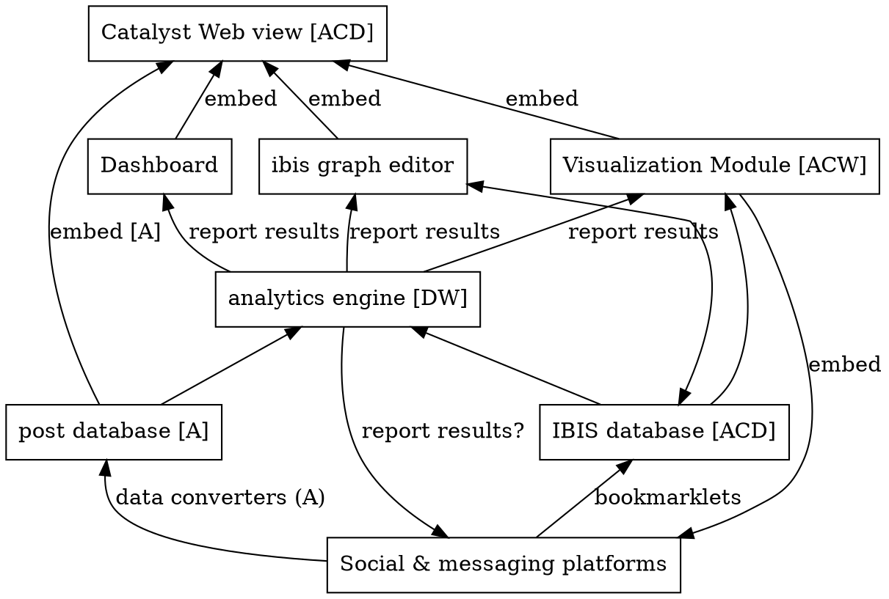
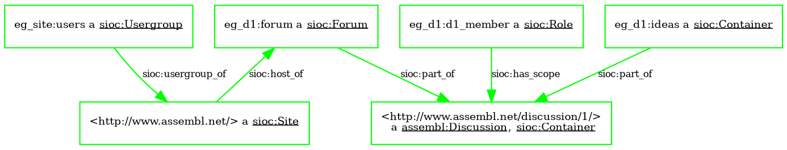
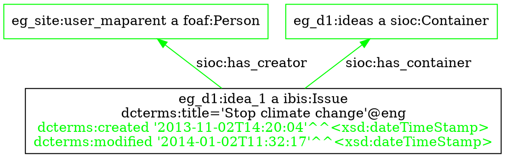
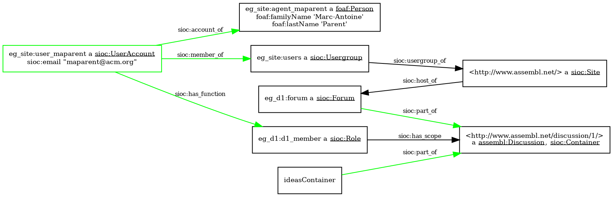
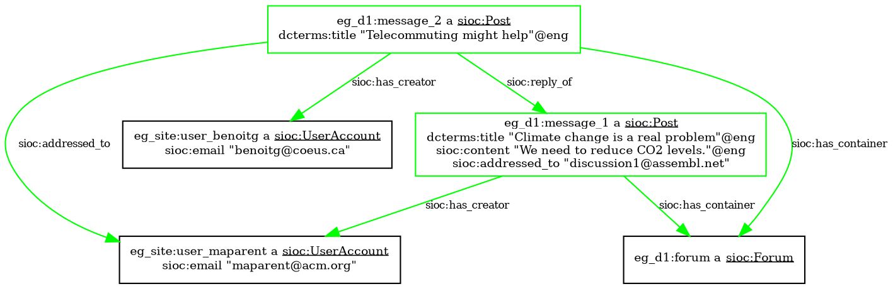
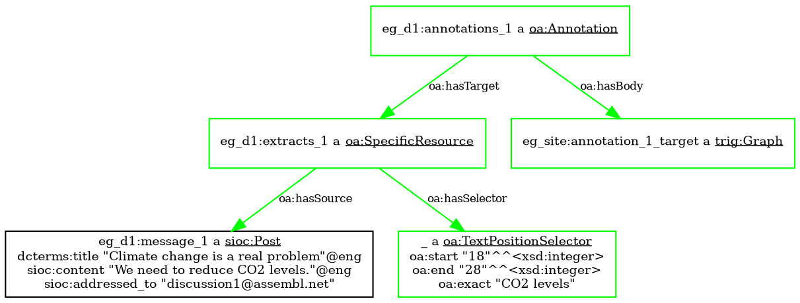
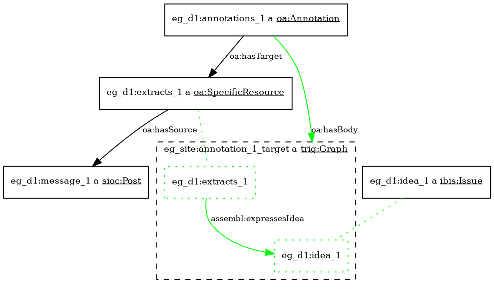
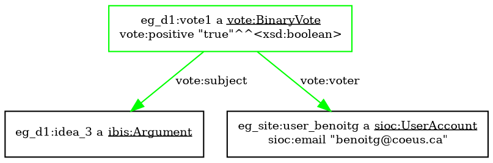
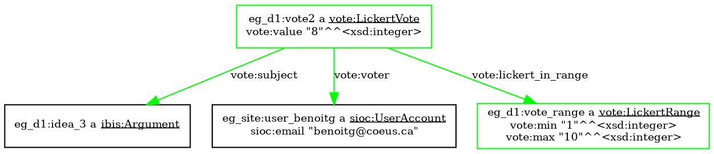
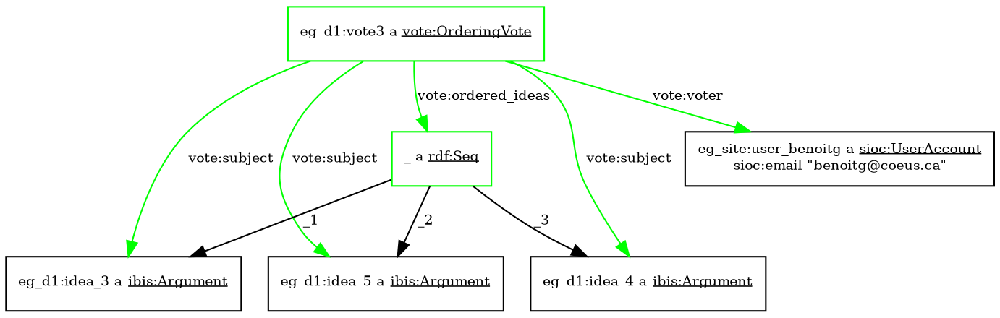

Latex Input: mmd-memoir-header
Latex Input: extra-packages
Base Header Level: 2
Email: maparent@acm.org, benoitg@coeus.ca
BibTex: catalystinterop
MainLanguage: english
Title: Catalyst interoperability operation
Author: Marc-Antoine Parent, Benoît Grégoire
Affiliation: Imagination for people
Latex Footer: mmd-memoir-footer
Latex Input: mmd-memoir-begin-doc
Format: complete

# Prerequisites

This document assumes a basic understanding of the following technologies, which are best described in their respective tutorials.

* REST
* RDF
* Turtle syntax
* JSON-LD
* SPARQL

# Architectural components



This is a view of components, and their expected interactions.

## Post database

The 

# Expected interoperability mechanisms

name technology involved on the bus between any two connected components.
API endpoints would go into another chapter.

## Main communication bus between platforms

### Basics RESTful calls and JSON-LD

### vetted SPARQL queries

### event mechanism (out of scope)

### Example: Platforms and analytics

## Platform and visualizations

### Simple client-side widgets

### Widgets with a server component

### Example: voting

### Deep interoperability with events

# Data model

Location of Ontologies, JSON-LD context, etc.

## Generic ideas

## The IBIS model

```turtle
eg_d1:idea_1 a ibis:Issue;
    dcterms:title "Stop climate change"@eng;
    dcterms:description "A longer description"@eng.

eg_d1:idea_2 a ibis:Position;
    dcterms:title "We should telecommute"@eng.

eg_d1:idealink_2_1 a ibis:PositionRespondsToIssue;
    ibis:response_position eg_d1:idea_2;
    ibis:response_issue eg_d1:idea_1 .

eg_d1:idea_3 a ibis:Argument;
    dcterms:title """Personal transport is a big part 
        of fuel consumption."""@eng.

eg_d1:idealink_3_2 a ibis:ArgumentSupportsPosition;
    ibis:argument_supporting eg_d1:idea_3;
    ibis:position_supported eg_d1:idea_2.
```

## SIOC and containers

```turtle
@prefix eg_site: <http://www.assembl.net/> .
@prefix eg_d1: <http://www.assembl.net/discussion/1/> .

<http://www.assembl.net/> a sioc:Site ;
    sioc:host_of eg_d1:forum.

<http://www.assembl.net/discussion/1/> 
    a assembl:Discussion, sioc:Container.

eg_d1:forum a sioc:Forum ;
    sioc:part_of eg_site:discussing_ibis .

eg_d1:ideas a assembl:Ideas, sioc:Container;
    sioc:part_of <http://www.assembl.net/discussion/1/> .

eg_site:users a sioc:Usergroup;
    sioc:usergroup_of <http://www.assembl.net>.

eg_d1:d1_member a sioc:Role;
    sioc:has_scope <http://www.assembl.net/discussion/1/> .
```



## FOAF and users

```turtle
eg_d1:idea_1 a ibis:Issue;
    dcterms:title "Stop climate change"@eng;
    dcterms:description "A longer description "@eng;
    sioc:has_creator eg_site:user_maparent;
    dcterms:created "2013-11-02T14:20:04"^^xsd:dateTimeStamp;
    dcterms:modified "2014-01-02T11:32:17"^^xsd:dateTimeStamp;
    sioc:has_container eg_d1:ideas.
```






```turtle
@prefix eg_site: <http://www.assembl.net/> .
@prefix eg_d1: <http://www.assembl.net/discussion/1/> .

eg_site:agent_maparent a foaf:Person;
    foaf:familyName "Marc-Antoine";
    foaf:firstName "Parent".

eg_site:user_maparent a sioc:UserAccount;
    sioc:account_of eg_site:agent_maparent;
    sioc:has_function eg_d1:d1_member;
    sioc:member_of eg_site:users;
    sioc:email "maparent@acm.org".

eg_site:agent_benoitg a foaf:Person;
    foaf:familyName "Gregoire";
    foaf:firstName "Benoit".
```

### Pseudonymization

## SIOC and posts



```turtle
eg_d1:message_1 a sioc:Post ;
    dcterms:created "2013-11-01T09:00:04"^^xsd:dateTimeStamp;
    dcterms:title "Climate change is a real problem"@eng;
    sioc:content """We need to reduce CO2 levels."""@eng;
    sioc:has_creator eg_site:user_maparent;
    sioc:addressed_to "discussion1@assembl.net";
    sioc:has_container eg_d1:forum.

eg_d1:message_2 a sioc:Post ;
    dcterms:title "Telecommuting might help"@eng;
    sioc:has_creator eg_site:user_benoitg;
    sioc:addressed_to eg_site:user_maparent;
    sioc:has_container eg_d1:forum;
    sioc:reply_of eg_d1:message_1.
```

## Quotes




```turtle
eg_d1:extracts_1 a oa:SpecificResource;
    oa:hasSource eg_d1:message_1;
    oa:hasSelector [
        a oa:TextPositionSelector;
        oa:start "18"^^xsd:integer;
        oa:end "28"^^xsd:integer;
        oa:exact "CO2 levels"@eng
    ].

eg_d1:annotations_1 a oa:Annotation;
    oa:hasTarget eg_d1:extracts_1;
    oa:hasBody eg_site:annotation_1_target.
```

### Relating the comment to the idea




```turtle
eg_d1:annotations_1 a oa:Annotation;
    oa:hasTarget eg_d1:extracts_1;
    oa:hasBody eg_site:annotation_1_target.

eg_site:annotation_1_target a trig:Graph.

# The annotation body (a named graph) links the text extract to an idea.

eg_site:annotation_1_target = {
    eg_d1:extracts_1 assembl:expressesIdea eg_d1:idea_1.
}
```

## Voting

### Binary




```turtle
eg_d1:vote1 a vote:BinaryVote;
    vote:voter eg_site:user_benoitg;
    dcterms:created "2013-11-02T14:20:04"^^xsd:dateTimeStamp;
    vote:subject eg_d1:idea_3;
    vote:positive "true"^^xsd:boolean.
```

### Lickert




```turtle
eg_d1:vote_range a vote:LickertRange;
    vote:min "1"^^xsd:integer;
    vote:max "10"^^xsd:integer.

eg_d1:vote2 a vote:LickertVote;
    vote:voter eg_site:user_benoitg;
    vote:subject eg_d1:idea_3;
    vote:lickert_in_range eg_d1:vote_range;
    vote:lickert_value "8"^^xsd:integer.
```

### Ordering



```turtle
eg_d1:vote3 a vote:OrderingVote;
    vote:voter eg_site:user_benoitg;
    vote:ordered_ideas [ a rdf:Seq;
        rdf:_1 eg_d1:idea3;
        rdf:_2 eg_d1:idea5;
        rdf:_3 eg_d1:idea4 ].
```

## Tags, comments, etc.

## History

Many analytics require access to a detailed history of user interactions. On the other hand, few platforms maintain such a history. Adding history tracking to platforms is a non-trivial operation, and we should think in terms of different levels of support. These levels must be validated with Mark, who is developing most history-based analytics. (Wikitalia uses static analysis.)

The most basic level conceivable could be based on timed automatic snapshots of the idea graph; is this even usable for any of the analytics? We will not consider this option until we have an answer.

Historical data is otherwise composed of a stream of change events; it should be possible to query the database for a subset of change events by date. At the most basic levels, each event takes the form of a triplet: An agent (Noun) does an action (Verb) on a target object (or objects.) (This is similar to the model used in the Experience API.)

Agents are URI identifiers to (probably pseudonymized) users; Verbs are taken from a very limited closed vocabulary; and targets are URI references. Details about the target should be obtained using the usual RESTful API to obtain the object graph (preferably as collections.) Note that this will not in general allow to fully reconstitute the prior state; that would be left to optional arguments in a third layer of support.

### Known change types

At the most basic level, we can distinguish creation, destruction, or modification of a given target object. More advanced user operations (access, moving, cloning, merging) that involve multiple target objects, could belong to a second layer of support. This is not to say that such operations are not recorded in an application that only provides the first layer of support, but that they would expressed in terms of layer-1 operations, with some loss of information.

So here is the list of operations:

* Create (target, original_context?)
* Delete (target)
* Update (target, affected_properties*)
* Access (target)
* Move (target, new_context?, affected_links*)
* Clone (clone, original?)
* Merge (target, sources*)

A few notes on this model: 

1. Giving the target as an URI (vs data) in the "delete" operation implies that the corresponding data should still be retrieved, as a "tombstoned" object. This may be a level 2 requirement (or level 3?) At the first level of support, a query for the deleted object may return a HTTP 404 Not Found, HTTP 410 Gone, or equivalent.

2. This list does not show layer 3 arguments for full history playback. Even in layer 2, new_context could be optional. The original nodes used for clone and merge node operations could be recorded as `dcterms:source` links in the static object structure, as opposed to optional arguments in history objects. (Should we agree on one way of doing this? What is easiest for existing platforms, including platforms such as Drupal used by Wikitalia?)

3. Presuming links are first-class objects in the implementation, a user operation corresponding to a node move can manifest either as a combination of link destruction and creation, or as a link update (of either its source or target property.) This is implementation dependent, though we would recommend the latter. As a consequence, the affected links given as parameters to the move operation in layer 2 support could be tombstones.

4. Objects are often created within a context. This is especially true of dependent objects, such as comments. As this context may be lost with further update or move operations, me might consider giving the original context in the change objects, as a partial implementation of level 3 support.

5. When we specify updated properties, there are many kinds of properties to consider. I am seriously considering distinguish those as separate update subtypes.
    1. Properties intrinsic to the object : e.g. its name.
    2. Properties that are defined locally on a per-user basis, such as votes and (maybe) read status.
    3. Properties that are defined by a user, but whose impact is global: e.g. tags.
    4. Lifecycle changes (e.g. moderator validation, locking.) In this case, the old state should be given as an argument, even in layer 2 support.

### Known object types

The simplicity of the verbs is complemented by an open model of the types of object that are referred to, using RDF classes. (New object classes may be introduced by different implementations, which would by default be ignored by the analytics engines, unless they are RDF subclasses of the established object list.) Here is a first cut of existing object types in our platforms:

* Generic ideas (nodes)
* Links
* Posts (for Assembl)
* Views (curated or automated collections of nodes and links, such as Compendium Maps or Assembl synthesis)
* Quotes (from posts or websites)
* Comments
* Tags? (They could be treated as either first-class objects or an extrinsic property like votes. Suggestions welcome.)

### Lifecycle events

Similarly, we need to agree on a list of key lifecycle events on objects. Here, we do not mean creation, access, etc. but more methodology-dependent events such as:

* Moderator review
* Moderator approval
* Moderator rejection
* Un/Locking
* De/Activation
* Reversion to an earlier state

### Summary of the first level of support

This would be minimal support for history, just showing who did what. Most information would still come from the current state of the ressource graph.

Change types:

* Create (target)
* Delete (target)
* Update (target, lifecycle_event?)

Object types:

* Generic ideas (nodes)
* Links
* Posts (for Assembl)

### Summary of second level of support

This would represent a more advanced level of support, with a finer picture of major lifecycle events. That may be the minimal level for advanced analytics. All change types and object types, as defined above, would be used. Note that context information in change and move events, as well as affected_properties in update events, would still be optional, but encouraged.

Some extra level of information (e.g. editing distance for text property updates) may be useful to analytics, and independently specified.

### Third level of support: full history

Here, we would give enough information to reconstitute the state of the database at any point. This means that creation events should store the initial state of an object, and updates and moves should give the new value of any affected property. This is close to the level that was proposed originally.

Some aspects of this api are still under design, as we believe we can design them so as to fulfill two accessory goals:

1. The change operations should come with a commutative algebra, so they can be used as [operational transformations](http://en.wikipedia.org/wiki/Operational_transformation) on the object graph.

2. Besides recording history, a complete description of user operations allows component interoperability. A graph editor widget, for example, could use the same vocabulary to to express user changes to the data model to a container platform.

Both those aspects are out of scope for catalyst 1, and this may even be true of the third level of support as a whole. However, designing the API so it does not clash with those ulterior goals in mind is both possible and desirable.

# API endpoints

## The data graph

## The history graph


# Security considerations

## Pseudonymisation support

## Levels of access for tools

## Personal limits to views

## Credential-passing for platforms

## Filtering json-ld?

# Appendices

## Relation to other vocabularies

### IBIS PA

### AIF
