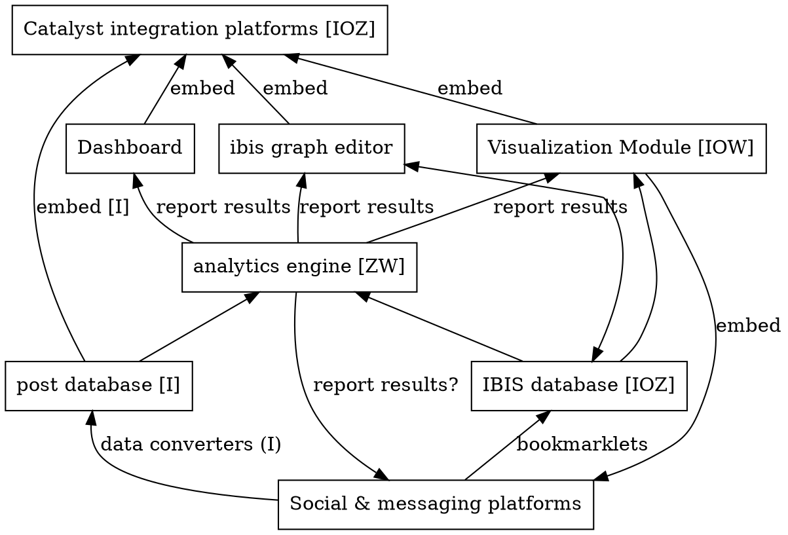
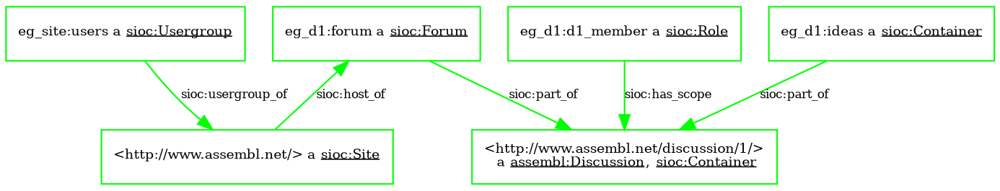
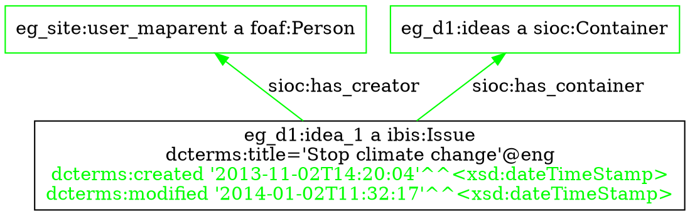
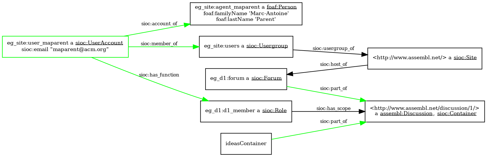
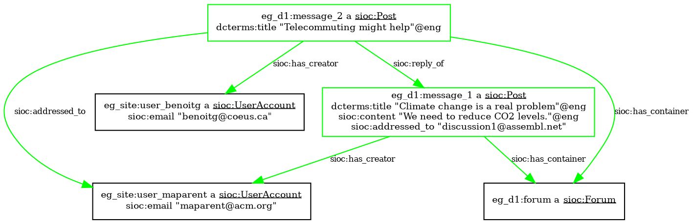
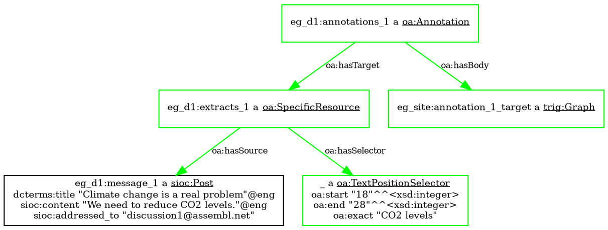
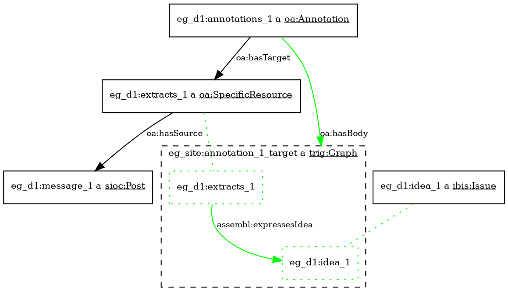
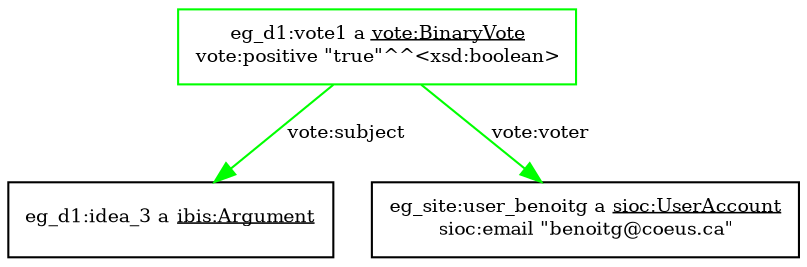
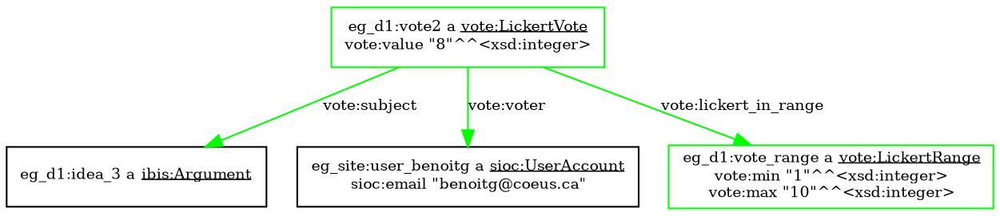
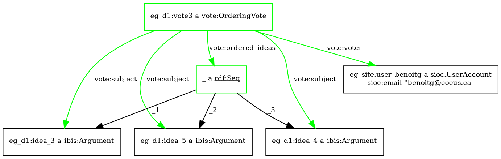

Latex Input: mmd-memoir-header
Latex Input: extra-packages
Base Header Level: 2
Email: maparent@acm.org, benoitg@coeus.ca
BibTex: catalystinterop
MainLanguage: english
Title: Catalyst interoperability operation
Author: Marc-Antoine Parent, Benoît Grégoire
Affiliation: Imagination for people
Latex Footer: mmd-memoir-footer
Latex Input: mmd-memoir-begin-doc
Format: complete

# Introduction

# Prerequisites

This document assumes a basic understanding of the following technologies, which are best described in their respective tutorials.

* [REST](http://rest.elkstein.org/)
* [RDF](http://www.w3.org/2007/02/turtle/primer/)
* [Turtle syntax](http://www.w3.org/TR/turtle/)
* [JSON-LD](json-ld.org/spec/latest/json-ld/)
* [SPARQL 1.1](http://www.w3.org/TR/sparql11-overview/) ([tutorial](http://www.cambridgesemantics.com/semantic-university/sparql-by-example))

# Architectural components



This is a view of components, and their expected interactions. (Letters represent technical partners)

## IBIS database

The most central component is the IBIS database. 

## Catalyst integration platforms

## Visualisation components

## Social and messaging platforms

## Post database and converters

## Analytics components

## Voting components

# Expected interoperability mechanisms

name technology involved on the bus between any two connected components.
API endpoints would go into another chapter.

## Main communication bus between platforms

### Basics RESTful calls and JSON-LD

Most server components are expected to expose RESTful endpoints that enable read and write access to the object graph. This will be the main point of access for client components. In particular, there will be one main URL for the server configuration that will give the endpoints for collections for all other data types. (To be discussed: We could use a subset of [Hydra](http://www.markus-lanthaler.com/hydra/) to describe endpoints.)

At minimum, the main URL will give, for each conversation, an URL for the idea collection, one for each post collection (grouped by origin), and one for the set of users (if available.) Those URLs will return the appropriate object graph as JSON-LD. Each resource must be accessible

#### What you have to know about RDF while using JSON-LD

JSON-LD is meant to mostly look like just another JSON format, where many of the properties are valid URLs which specify where you can get more information about a given ressource. However, there are a few pitfalls.

*Inheritance*: the `@type` argument in JSON-LD corresponds to a RDF class. It may be a subclass of the RDF class you expect. Similarly, every property may be a subproperty of the RDF property you expect. The JSON-LD `@context` will give you the ontology specifications; a RDF database can use the ontologies to answer sparql queries specified using known superclasses. 

However, one goal of this specification is that tools should participate in the ecosystem without RDF machinery. So compliant tools SHOULD give multiple values for the `@type` parameters when appropriate, so that at least one comes from the catalyst classes specified in this document. This does not, however, solve the problem of subproperties; these should be avoided for this reason.

*Inverses*: Some RDF properties define inverses: for example `sioc:creator_of owl:inverseOf sioc:has_creator`. Some of those inverse are not specified in the ontology, such as `dcterms:isPartOf` and `dcterms:hasPart`. (We will define a subproperty to specify this.) The list of such inverses is short, and well specified in the ontology documents. Tools that receive JSON-LD from a catalyst platform are expected to interpret either of those relationships as implying the other.

<!-- todo: specify a subproperty of hasPart -->

*Multiple identity*: URIs do not have to be unique in general, and a given object may have multiple identities. This would be marked with the `owl:sameAs`. 

#### Aggregates and individual resources


### vetted SPARQL queries

### event mechanism (out of scope)

### Example: Platforms and analytics

## Platform and visualizations

### Simple client-side widgets

### Widgets with a server component

### Example: voting

### Deep interoperability with events

# Data model

Location of Ontologies, JSON-LD context, etc.

## Generic ideas

Though we have chosen to focus on IBIS within the Catalyst consortium, the general problem of discourse visualization has been approached through a variety of different models: formal logic and its varieties (modal, etc.); rhetorical tropes; argumentation schemes; decision theory; defeasability, etc. In all cases, we can distinguish the following principles:

1. Networked context: Many ideas take their full meaning from the network of its associations with other ideas. In the case of IBIS, for example, an Argument's meaning can be hard to interpret without knowing what Option it bolsters. So we have a network structure of links and nodes, as opposed to conceptual monads.
2. Abstract schemes: A configuration of a sub-network of ideas and links can be identified as an instance of a more abstract scheme. (This is the essence of AIF.)
3. Implicit or explicit containment: An idea can often be decomposed or refined into sub-ideas. For example, an argument may depend on a hidden assumption, or refer to an issue that has not yet been isolated. Conversely, an Option can represent a collection of actions, each of which had been considered separately before.
4. Theme and variation: many people will propose similar ideas, which are variations of each other. It is often possible to specify independently what they have in common and how they differ.

These considerations are mostly out of scope for Catalyst, but we have seen it as appropriate to define an abstract notion of generic idea (node) and link as abstract superclasses of the IBIS nodes and links, for future-proofing purposes. Those classes have also been aligned with the AIF ontology to address point 2. Finally, RDF properties have been defined to address point 3 and 4, but they will not be used in the scope of this project.

This is more than an academic exercise, as one of the platforms (Assembl) will allow the creation of generic ideas that do not have an IBIS type, but may acquire it later. Client tools may expect generic ideas from this platform, and maybe others.

## The IBIS model

```turtle
eg_d1:idea_1 a ibis:Issue;
    dcterms:title "Stop climate change"@eng;
    dcterms:description "A longer description"@eng.

eg_d1:idea_2 a ibis:Position;
    dcterms:title "We should telecommute"@eng.

eg_d1:idealink_2_1 a ibis:PositionRespondsToIssue;
    ibis:response_position eg_d1:idea_2;
    ibis:response_issue eg_d1:idea_1 .

eg_d1:idea_3 a ibis:Argument;
    dcterms:title """Personal transport is a big part 
        of fuel consumption."""@eng.

eg_d1:idealink_3_2 a ibis:ArgumentSupportsPosition;
    ibis:argument_supporting eg_d1:idea_3;
    ibis:position_supported eg_d1:idea_2.
```

## SIOC and containers

```turtle
@prefix eg_site: <http://www.assembl.net/> .
@prefix eg_d1: <http://www.assembl.net/discussion/1/> .

<http://www.assembl.net/> a sioc:Site ;
    sioc:host_of eg_d1:forum.

<http://www.assembl.net/discussion/1/> 
    a assembl:Discussion, sioc:Container.

eg_d1:forum a sioc:Forum ;
    sioc:part_of eg_site:discussing_ibis .

eg_d1:ideas a assembl:Ideas, sioc:Container;
    sioc:part_of <http://www.assembl.net/discussion/1/> .

eg_site:users a sioc:Usergroup;
    sioc:usergroup_of <http://www.assembl.net>.

eg_d1:d1_member a sioc:Role;
    sioc:has_scope <http://www.assembl.net/discussion/1/> .
```



## FOAF and users

```turtle
eg_d1:idea_1 a ibis:Issue;
    dcterms:title "Stop climate change"@eng;
    dcterms:description "A longer description "@eng;
    sioc:has_creator eg_site:user_maparent;
    dcterms:created "2013-11-02T14:20:04"^^xsd:dateTimeStamp;
    dcterms:modified "2014-01-02T11:32:17"^^xsd:dateTimeStamp;
    sioc:has_container eg_d1:ideas.
```






```turtle
@prefix eg_site: <http://www.assembl.net/> .
@prefix eg_d1: <http://www.assembl.net/discussion/1/> .

eg_site:agent_maparent a foaf:Person;
    foaf:familyName "Marc-Antoine";
    foaf:firstName "Parent".

eg_site:user_maparent a sioc:UserAccount;
    sioc:account_of eg_site:agent_maparent;
    sioc:has_function eg_d1:d1_member;
    sioc:member_of eg_site:users;
    sioc:email "maparent@acm.org".

eg_site:agent_benoitg a foaf:Person;
    foaf:familyName "Gregoire";
    foaf:firstName "Benoit".
```

### Pseudonymization

## SIOC and posts



```turtle
eg_d1:message_1 a sioc:Post ;
    dcterms:created "2013-11-01T09:00:04"^^xsd:dateTimeStamp;
    dcterms:title "Climate change is a real problem"@eng;
    sioc:content """We need to reduce CO2 levels."""@eng;
    sioc:has_creator eg_site:user_maparent;
    sioc:addressed_to "discussion1@assembl.net";
    sioc:has_container eg_d1:forum.

eg_d1:message_2 a sioc:Post ;
    dcterms:title "Telecommuting might help"@eng;
    sioc:has_creator eg_site:user_benoitg;
    sioc:addressed_to eg_site:user_maparent;
    sioc:has_container eg_d1:forum;
    sioc:reply_of eg_d1:message_1.
```

## Quotes




```turtle
eg_d1:extracts_1 a oa:SpecificResource;
    oa:hasSource eg_d1:message_1;
    oa:hasSelector [
        a oa:TextPositionSelector;
        oa:start "18"^^xsd:integer;
        oa:end "28"^^xsd:integer;
        oa:exact "CO2 levels"@eng
    ].

eg_d1:annotations_1 a oa:Annotation;
    oa:hasTarget eg_d1:extracts_1;
    oa:hasBody eg_site:annotation_1_target.
```

### Relating the comment to the idea




```turtle
eg_d1:annotations_1 a oa:Annotation;
    oa:hasTarget eg_d1:extracts_1;
    oa:hasBody eg_site:annotation_1_target.

eg_site:annotation_1_target a trig:Graph.

# The annotation body (a named graph) links the text extract to an idea.

eg_site:annotation_1_target = {
    eg_d1:extracts_1 assembl:expressesIdea eg_d1:idea_1.
}
```

## Voting

### Binary




```turtle
eg_d1:vote1 a vote:BinaryVote;
    vote:voter eg_site:user_benoitg;
    dcterms:created "2013-11-02T14:20:04"^^xsd:dateTimeStamp;
    vote:subject eg_d1:idea_3;
    vote:positive "true"^^xsd:boolean.
```

### Lickert




```turtle
eg_d1:vote_range a vote:LickertRange;
    vote:min "1"^^xsd:integer;
    vote:max "10"^^xsd:integer.

eg_d1:vote2 a vote:LickertVote;
    vote:voter eg_site:user_benoitg;
    vote:subject eg_d1:idea_3;
    vote:lickert_in_range eg_d1:vote_range;
    vote:lickert_value "8"^^xsd:integer.
```

### Ordering



```turtle
eg_d1:vote3 a vote:OrderingVote;
    vote:voter eg_site:user_benoitg;
    vote:ordered_ideas [ a rdf:Seq;
        rdf:_1 eg_d1:idea3;
        rdf:_2 eg_d1:idea5;
        rdf:_3 eg_d1:idea4 ].
```

## Tags, comments, etc.

## History

Many analytics require access to a detailed history of user interactions. On the other hand, few platforms maintain such a history. Adding history tracking to platforms is a non-trivial operation, and we should think in terms of different levels of support. These levels must be validated with Mark, who is developing most history-based analytics. (Wikitalia uses static analysis.)

The most basic level conceivable could be based on timed automatic snapshots of the idea graph; is this even usable for any of the analytics? We will not consider this option until we have an answer.

Historical data is otherwise composed of a stream of change events; it should be possible to query the database for a subset of change events by date. At the most basic levels, each event takes the form like that of a sequence: At a given Timestamp (When), agent (Noun) does an action (Verb) on a target object (or objects), with some optional contextual arguments that depend on the verb. (This is similar to the model used in the Experience API.)

Agents are URI identifiers to (probably pseudonymized) users; Verbs are taken from a very limited closed vocabulary; and targets are URI references. Details about the target should be obtained using the usual RESTful API to obtain the object graph (preferably as collections.) Note that this will not in general allow to fully reconstitute the prior state; that would be left to optional arguments in a second layer of support.

### Known change types

At the most basic level, we can distinguish creation, destruction, or modification of a given target object. More advanced user operations (moving, cloning, merging) that involve multiple target objects, could belong to a second layer of support. This is not to say that such operations are not recorded in an application that only provides the first layer of support, but that they would expressed in terms of layer-1 operations, with some loss of information.

So here is the list of fundamental operations:

* Create (target, original_context?)
* Delete (target)
* Update generic property (target, property_names[^genericprop]*)
* Change Read status (target, valence, strength?[^readstatus])
* Annotate an object with a per-user[^peruser] property (target, property_name, value)
    * Trouble tags (spam, etc.)
    * Vote
    * Rating[^rating]
    * Bookmarks
    * Tags
* Annotate an object with a public link to another full-fledged object (targetted link)
    * Quotes
    * Posts
    * Comments
    * Tags
* Change of object status
    * Moderator approval (target)
    * Moderator rejection (target, reason)

[^genericprop]: We are still considering whether the the name of the properties that were affected by an update operation should be included in the first level of support. In particular, some implementers might change a row in a database without knowing which columns are affected. Also, note that the list of properties defined in the standard is closed, but implementers may introduce new properties or sub-properties. Feedback would be appreciated. 

[^readstatus]: Some platforms may define weaker or stronger signals that a user paid attention to a message. If a platform cannot distinguish those, it should only send strong signals.

[^peruser]: The visibility of per-user properties may be public, private, or public in the aggregate, depending on considerations outside the model, such as debate methodology. However, those signals are owned by the user, in that my vote is independent of your vote.

[^rating]: structurally, ratings are a kind of vote; but in most methodologies voting has to follow a protocol, whereas ratings are informal.

[^tags]: Tags may either be shared or belong to a user. We should allow both options.

A few other operations are more complex, and we are hesitating to include them.

* Move: corresponds to updates to link objects, which may be expressed as link creation/deletion.
* Clone: create an object with a structural reference (`dcterms:source`) to its origin.
* Merge: as clone, but the origins also happen to be deleted in another event (preferably with the same timestamp.)
* Undo: As update
* Translation: As update

A few notes on this model: 

1. Giving the target as an URI (vs data) in the "delete" operation implies that the corresponding data should still be retrieved, as a "tombstoned" object. This is considered to be a level 2 requirement. At the first level of support, a query for the deleted object may return a HTTP 404 Not Found, HTTP 410 Gone, or equivalent.

2. This list does not show layer 2 arguments for full history playback.

3. Presuming links are first-class objects in the implementation, a user operation corresponding to a node move can manifest either as a combination of link destruction and creation, or as a link update (of either its source or target property.) This is implementation dependent, though we would recommend the latter. As a consequence, the affected links given as parameters to the move operation in layer 2 support could be tombstones.

4. Objects are often created within a context. This is especially true of dependent objects, such as comments. As this context may be lost with further update or move operations, a platform may give the original context in the change objects, as a partial implementation of level 2 support.

5. Some complex user actions (like move or merge) can become multiple events. In that case, best practice would be to use the same timestamp.

### Known object types

The simplicity of the verbs is complemented by an open model of the types of object that are referred to, using RDF classes. (New object classes may be introduced by different implementations, which would by default be ignored by the analytics engines, unless they are RDF subclasses of the established object list.) Here is a first cut of existing object types in our platforms:

* Discussions (a set of ideas taken as a whole)
* Generic ideas (nodes)
* Idea Links
* Views (curated or automated collections of nodes and links, such as Compendium Maps or Assembl synthesis)
* Posts (for Assembl) and Comments (as a sub-case of posts)
    * Quotes (extracted from posts or websites)
* Idea annotation links
* Tags (at least public tags, as opposed to private tags.)

Notes:

* Comments (as in Deliberatorium) can be considered a form of post that directly answers a Generic Idea.
* In Assembl, Posts are related to Generic Ideas through Quotes. More generally, a Quote could be related to more than one Generic Idea through an Annotation Link. The same kind of link can also link a Generic Idea to a whole post or a comment. It would be consistent to treat Tags through the same mechanism (to be discussed.)

### Changes to object status

Similarly, we need to agree on a list of object status. What we have now is moderator approval or rejection, used in Deliberatorium. Deliberatorium includes a series of reasons for rejections, we will need to specify this list.

We may also have lifecycles events that apply to the whole discussion, if the methodology expects the discussion to go through many phases. This needs more discussion between partners.

### Summary of the different levels of support

The main difference between the two levels is how much history is stored: Tombstones and past property values.
As mentioned, the list of changed properties may or may not be required of a first-level implementation.
Some extra level of information (e.g. editing distance for text property updates) may be useful to analytics, and independently specified for level 1.

To support layer 2, the platform would retain enough information to reconstitute the state of the database at any point. This does not mean that giving an object graph at a given timepoint is the responsibility of the platform. But it does mean that creation events should store the initial state of an object, and updates and moves should give the new value of any affected property. This is close to the level that was proposed originally.

Some aspects of this api are still under design, as we believe we can design them so as to fulfill two accessory goals:

1. The change operations should come with a commutative algebra, so they can be used as [operational transformations](http://en.wikipedia.org/wiki/Operational_transformation) on the object graph.

2. Besides recording history, a complete description of user operations allows component interoperability. A graph editor widget, for example, could use the same vocabulary to to express user changes to the data model to a container platform.

Both those aspects are out of scope for catalyst 1, and this may even be true of the third level of support as a whole. However, designing the API so it does not clash with those ulterior goals in mind is both possible and desirable.

# API endpoints

## The data graph

## The history graph


# Security considerations

## Pseudonymisation support

## Levels of access for tools

## Personal limits to views

## Credential-passing for platforms

## Filtering json-ld?

# Appendices

## Relation to other vocabularies

### IBIS PA

### AIF
