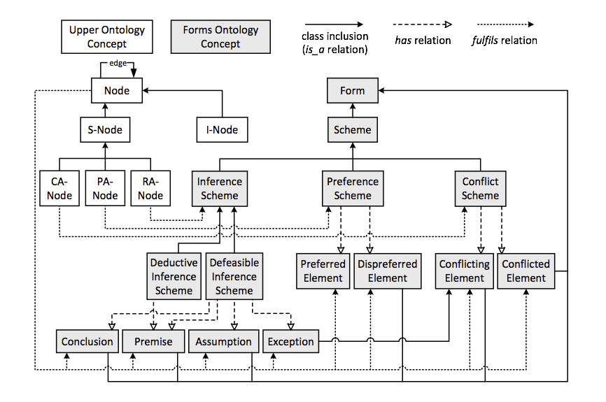

Latex Input: mmd-memoir-header
Latex Input: extra-packages
Base Header Level: 2
Email: maparent@acm.org, benoitg@i4p.org
BibTex: catalystinterop
MainLanguage: english
Title: Catalyst interoperability operation
Subtitle: PRELIMINARY DOCUMENT
Revision: 0.01
Author: Marc-Antoine Parent, Benoit Grégoire
Affiliation: Imagination for people
Latex Footer: mmd-memoir-footer
Latex Input: mmd-memoir-begin-doc
Format: complete

# Introduction

Many tools have been built to try to solve various problems in online collective intelligence.  This consortium believes that the lack of shared standards to allow such tools to exchange data with each other and share results on standard Internet tools has prevented them to build upon one-another and greatly hurt the broader adoption of specialized collective intelligence tools in Internet discussions.

This document attempts to describe and standardize the most common interactions of software tools applicable to this field to foster reuse, experimentation and adoption.  It is build upon the belief that at this stage in the adoption curve of software intelligence tools, a "lowest common denominator" approach will allow the best chance that multiple tools outside the catalyst consortium will adopt the standard.

# Requirements

## Sharing raw concept maps

Most collective intelligence tools allow organizing ideas in some sort of structure (a concept map in the broadest sense).  How to represent the following in a systems-independent way while  preserving as much semantic as practical, is the core of this specification:

 * The concepts of the concept map
 * The people interacting with them
 * Their interactions (Posts, comments, votes, etc.)

It is interesting to share such representations between tools to enable:

 * Developing reusable analytics
 * Developing reusable Visualization

The type and amount of structure can vary greatly between systems, but there are some useful levels of "shared semantics" that are achievable relatively easily. 

The first and most basic is sharing the raw structure of the map (nodes, edges) with very basic information (such as node title).  This allows several visualizations tools to be applied, as well as a significant number of metrics.

The second is to share more semantics as about the nature of the concepts identified.  It was felt by the consortium that using IBIS (Issue-Based Information System) as a common baseline would help foster building initial tooling.  While it has significant limitations, IBIS is a good choice because:

 1. It's widely used by collective intelligence software
 2. Many systems not using IBIS could transform at least a subset of their data into meaningful IBIS.

## Re-usable analytics

Analytics take several forms, but all take data from the Data Model defined later, perform some computation and return either:

1. Pull:
    1. Structured data for further computation, transformation or visualization.
    2. Visualizations (possibly interactive) or reports directly usable by a human 
2. Push:
    1. Attention mediation signals to be processed by some deliberation environment (format to be defined).

## Re-usable visualizations

Visualization components take as input a some subset of a concept map, and transform it into a representation suitable for humans.  Some are static (images), some dynamic (widgets).  Some allow entering additional data in the representation, or navigating the concept map.  But all have a need to be shared on the wider Internet for maximum impact (social networks, emails or even print.).

## Obtaining and representing raw contributions from messaging platforms

A variety of tools and social networks allow participants to exchange messages on the Internet.  Sadly, they are all in different formats, making the user, reuse and analytics of those interactions needlessly painful.  The catalyst ecosystem standardized on SIOC (Semantically-Interlinked Online Communities) as a data model, and will write tools to make several other formats available as SIOC.  This way, analytics and annotation environments have only one format to process. 

## Re-usable interactive widgets
One example of of field of Collective Intelligence that is quite mature, is voting.  How to avoid many common voting biases is well known in academia, has been for years, but adequate tools are not widely used on the Internet.  In fact such tools, in reusable form, are simply not available on the Internet, and the same is true of ideation facilitation or collective action tools.

The main problem here is not the lack of standards, but the number of incompatible, not widely deployed standards.

This specification will take a pragmatic approach, to attempt to at least provide a common denominator that is sufficient for our narrow field, technology independent, and allows the minimal number of requirements for sharing widgets OUTSIDE the ecosystem (one web forums, web sites, social networks, etc.)

# Architectural components


This is a view of components, and their expected interactions. (Letters represent catalyst technical partners expected to develop at least one such a component)

<!-- TODO Graph above and description below are out of sync -->

IBIS database
: The most central component is the IBIS database, which holds most of the information about the concepts and ideas being built and discussed by participants.

Catalyst integrated platforms
: These are the general web platforms that users interact with that fully exploit the data model: they include Open University's DebateHub, IP's Assembl, MIT's Deliberatorium.

Social and messaging platforms
: These are existing social and messaging platforms where users can post messages, such as email, facebook, twitter, blogs, etc. This also includes some CMS used by our partners, such as Drupal for Wikitalia or Utopia.de for Euclid.  How deeply they can integrate catalyst services depend on their facility for integrating plugins.

Visualisation components
: Visualization components show static or dynamic aspects of the IBIS and social graph, and may allow to navigate it (but not write to it) Some will be integrated directly in their respective Catalyst information platform, but most written as reusable Web components that can be embedded in social and messaging platforms.

Post database
: This component (and attendant converters) will extract messages from the social and messaging platforms and expose them to the Catalyst integration platforms, directly or through the analytics and voting components. Note that this means the user graph may be distributed between many databases (IBIS, Posts, and eventually voting.)

Analytics components
: The analytic components will extract data from the various databases and supply analytic results to the Catalyst platforms, possibly through visual components.

Voting components
: Voting is another good candidate for reusable components: We can define votes in a platform independent fashion. Each voting component would define voting values, store them in their own databases, and provide appropriate aggregates.

Server platforms
: This term will be used to refer collectively to the server components of the catalyst integration platforms, including the IBIS database, and the Post database server.

Client platforms
: This term will be used to refer collectively to components that are used by the server platforms to provide services, but generally expect to use data from the server platforms as input. This includes the analytics and visualization components. The voting component is also included here, though its status is less clear-cut.

# Prerequisites

This document assumes a basic understanding of the following technologies, which are best described in their respective tutorials.

* [REST](http://rest.elkstein.org/)
* [RDF](http://www.w3.org/2007/02/turtle/primer/)
* [Turtle syntax](http://www.w3.org/TR/turtle/)
* [JSON-LD](json-ld.org/spec/latest/json-ld/)
* [SPARQL 1.1](http://www.w3.org/TR/sparql11-overview/) ([tutorial](http://www.cambridgesemantics.com/semantic-university/sparql-by-example))


# Expected interoperability mechanisms

name technology involved on the bus between any two connected components.
API endpoints would go into another chapter.

## Main communication bus between platforms

### Simple JSON-LD access

A simple read-only access to the data should be adequate for many analytics and visualization purposes, and some partners may choose to implement this simple access method. Clients to the platform should be expected to access the data through one of the following mechanisms (choice of mechanism and endpoints to be part of configuration parameters):

1. Pulling all server data in JSON-LD from a single HTTP address
2. Pulling all server data relative to one unit of conversation, assuming a given platform server can host many different conversations with disjoint communities. This is necessary as each such conversation may define different access permissions.
3. Endpoints allowing to access the collection of each main type of resource, with some filtering ability (GET endpoints)
4. Read/write RESTful endpoints for the collection of each main type of resource (probably one such endpoint per unit of conversation.)
5. Read-only SPARQL Endpoints with agreed queries.
6. Read/write SPARQL endpoints.

Note that some of the social platforms we plan to integrate may not offer RDF data at all. The conversion of some of this data to RDF may be done within the scope of this project, but designing a generic way to do so is outside this scope, and is well handled by such known technologies as [GRDDL](http://www.w3.org/TR/grddl-primer/). Similarly, though some platforms (notably Drupal) will expose their data in RDFa, this still requires a crawling step and Catalyst tools are not expected to implement this. In the specific case of Drupal, we recommend installation of the [SPARQL module](https://drupal.org/project/sparql), or at least the [RESTful Web service module](https://drupal.org/project/restws).

### RESTful access endpoints

Most client components will want to interact with the data on the platform, and this will usually be done through RESTful read/write endpoints (option 4 above), one for each conversation unit and main resource type[^maintype]. Specifying these endpoints in each client's configuration would be tedious, and the client would be configured with a main URL that will yield a document describing all the other endpoints. This document could also be in JSON-LD, or we could use a subset of the [Hydra](http://www.markus-lanthaler.com/hydra/) format to describe endpoints.

[^maintype]: In general, main resource types correspond to abstract superclasses. We would consider IBIS nodes (aka GenericIdeas) to be a resource type, but the subtypes (Issue, Option and Argument) to be subtypes.

#### What you have to know about RDF while using JSON-LD

JSON-LD is meant to mostly look like just another JSON format, where many of the properties are valid URLs which specify where you can get more information about a given ressource. However, there are a few pitfalls.

*Inheritance*: the `@type` argument in JSON-LD corresponds to a RDF class. It may be a subclass of the RDF class you expect. Similarly, every property may be a subproperty of the RDF property you expect. The JSON-LD `@context` will give you the ontology specifications; a RDF database can use the ontologies to answer sparql queries specified using known superclasses. 

However, one goal of this specification is that tools should participate in the ecosystem without RDF machinery. So compliant tools SHOULD give multiple values for the `@type` parameters when appropriate, so that at least one comes from the catalyst classes specified in this document. This does not, however, solve the problem of subproperties; these should be avoided for this reason.

*Inverses*: Some RDF properties define inverses: for example `sioc:creator_of owl:inverseOf sioc:has_creator` (in other words, the fact that some user is the author of a Post in SIOC can be defined inside the Post object, or inside the user object). Some of those inverse are not specified in the ontology, such as `dcterms:isPartOf` and `dcterms:hasPart`. (We will define a subproperty to specify this.) The list of such inverses is short, and well specified in the ontology documents. Tools that receive JSON-LD from a catalyst platform are expected to interpret either of those relationships as implying the other.

<!-- todo: specify a subproperty of hasPart -->

*Multiple identity*: URIs do not have to be unique in general, and a given object may have multiple identities. This would be marked with the `owl:sameAs`. 

#### Aggregates and individual resources

In accordance with the general principles of linked data, each resource's IRI should be dereferencable as a URL. However, most client applications will need to access aggregates of resources, to allow for more efficient access. This requires those aggregates to also be named resources. Also, from a RESTful point of view, aggregates need to exist as target to PUT operations.

### Trusted or vetted SPARQL queries

Some platforms that have this capacity may allow trusted client tools (eg analytics, visualization, or voting modules) to make SPARQL queries or even updates directly against their database, as opposed to loading the whole object graph or navigating it in successive REST requests. This obviously allows for more efficient partial requests, in a way that can be independant of the specificities of the underlying abstract model of each platform.

In a broader ecosystem context, most platforms would not open the SPARQL endpoint to untrusted external tools, if only to avoid denial of service attacks using complex queries. However, a platform may choose to expose a subset of pre-defined sparql queries to unknown tools, and tool builders may propose useful SPARQL queries to platform builders.

### Example: Platforms and analytics

## Platform and visualizations

Reusable visual components that can be used across web sites is an old technical requirement, and the Web is riddled with different incompatible ways to partially fulfill it. Some new techniques are emerging, but we will need to balance forward thinking and flexibilty with ease of implementation, browser compatibility, and pragmatism. Instead of trying to find (or worse, define) a universal standard, we will define a variety of means to achieve varying levels of support. 

### Widgets with a server component

The simplest widget would have a server component, which could receive a request on a known endpoint, and return visualization data. The server would have to get the graph data that is to be visualized: either the json-ld graph could be part of the request, or the location of a REST or SPARQL endpoint on the platform server where the visualization server could get the data.

In the simplest case, the server would simply return an image; in some more elaborate cases, the visualization widget would have its own HTML snippet and attendant javascript to lay out and interact with the visualization data. This raises classical cross-origin data issues: If the widget code is hosted on the visualization server, it would require an authorization token to access the platform data, and vice-versa. Those problems have known solutions.

### Fully client-side widgets

A different scenario is that of a purely client-side visualization widget, simply a snippet of HTML with javascript. This can be done using [W3C Web widgets](http://www.w3.org/standards/techs/widgets) or maybe the emerging [W3C Web components](http://www.w3.org/TR/components-intro/), as described [here](http://www.html5rocks.com/en/tutorials/webcomponents/imports/). Such a widget would need to receive a configuration from the platform, giving the initial REST or SPARQL endpoint; it would then get its data by navigating the object graph from that endpoint.

### Example: voting


### Deep interoperability with events

In the most complex case, the widget would not only read the platform's data model, but also allow to edit it, or at least to tell the platform front-end about a user action initiated in the widget, such as node selection. This requires deep interoperability between the widget and the platform, presumably through sharing high-level change events between the widget and the platform. 

There are two ways to do this: The widget front-end may either communicate directly with a rich platform front-end, or indirectly through endpoints on the platform back-end. 

Let's first examine contact through the back-end: this can be done easily through RESTful editing commands on the data itself (POST and PUT), or through POSTing high-level user events (node selected, etc.) that would correspond to those stored in the audit history. The advantage of that approach is that it uses mechanisms we have already defined; the disadvantage is that, in most architectures, it is difficult for the platform server to push changes back to the platform front-end. (Assembl being an exception.)

The other option is for the widget front-end to exchange those same user events with the platform front-end. The advantage is that the widget front end needs to understand less about the platform backend endpoints; the disadvantage is that event passing between web components has not yet been standardized properly. We are left either with ad-hoc architectures, solutions that are heavily dependent on a specific front-end framework, or very heavy architectures such as [OpenSocial](http://opensocial.org/). This is going to be an area of further exploration for us.

# Security considerations

Though members of the Catalyst consortium have mostly worked with public conversations, we may have to deal with private conversations and we must ensure that our APIs do not open the door to unauthorized access. In general, access control will be granted to tools on a per-conversation basis.

## Pseudonymization support

In particular, the Catalyst project has an obligation to ensure that personal information is not transmitted without consent. As large parts of our project deals with social network analysis, this is a non-trivial requirement. One safe route would have been to only deal with public forums, where there is no assumption of anonymity. That said, some of our communities are involved in ongoing discussions, and have not signed research agreements beforehand, and we have to do the best we can to guarantee their privacy against at least the most basic attempts at re-identification.

To that purpose, the various platform should provide each tool they deal with pseudonymized data, that is data where the user identity is replaced by an opaque identity. This conversion must have the following properties:

1. It must be identity preserving, in that two ideas with the same author should be marked as belonging to the same pseudonym.
2. It must be reversible: if an analytic tool identifies someone as central in the social network, the platform should be able to identify the original user account.
3. It must not leak personal information (name, email, etc.)
4. The pseudonyms should vary by conversation unit. In particular, if the same user account is used in a public and private discussion on the same server, it should not be possible to tie those accounts together using the same pseudonym.
5. Similarly, if two tools are given data different views of the data on the same conversation with different degrees of access to personal information, they should not be given the same pseudonyms. This is only a consideration if we distinguish an intermediate level of access to personal information between "full access" and "no access"; this is very unlikely to be worth the added complexity.

Analysis tools must be granted access to APIs with a key that gives them access to certain discussions at a certain level, and not other discussions. On the other hand, the front-end of each platform will need access to at least some information about other participants in the discussion (at least their nickname), and hence the API access points used by the front-end will have to be secured.

In general, it is easy to create a database table that will associate a unique random URI to a combination of user account, conversation unit, and access level (if used). The SPARQL machinery can use `owl:sameAs` equivalence to associate those identities to user accounts. That equivalence table, as well as all user information, must be off-limit to any query engine (including SPARQL endpoints) that do not have proper access.

*Implementation note*: it would be much safer if all references to user accounts in the RDF model were made through the pseudonymization table, even at the database level. This is possible in new systems, much more difficult to add to existing systems. The alternative is to add a pseudonymizing filter at the exit, which could be bypassed by clever sparql queries. So we would discourage use of unvetted sparql queries for a database with direct reference to user records.

## Credential-passing for platforms

In general, this means that client platforms will have to use some form of authentication to extract data from server platforms. We suggest using the same form of authentication that the users themselves use, such as OAuth.

# Data model

The catalyst ontology is provisionally hosted on [Github](https://github.com/catalyst-fp7/ontology/). The URIs for the ontology have been reserved with <http://purl.org/>, as <http://purl.org/catalyst/idea>, etc. The ontology also hosts a simple JSON-LD [context](http://purl.org/catalyst/jsonld)

In the following, there will be instance diagrams and class diagrams. In the latter, we will use the following conventions:


## Generic ideas

Though we have chosen to focus on the semantics of IBIS within the Catalyst consortium, the general problem of discourse visualization has been approached through a variety of different models: formal logic and its varieties (modal, etc.); rhetorical tropes; argumentation schemes; decision theory; defeasability, etc. In all cases, we can distinguish the following principles:

<!-- todo: References -->

1. Networked context: Many ideas take their full meaning from the network of its associations with other ideas. In the case of IBIS, for example, an Argument's meaning can be hard to interpret without knowing what Option it bolsters. So we have a network structure of links and nodes, as opposed to conceptual monads.
2. Abstract schemes: A configuration of a sub-network of ideas and links can be identified as an instance of a more abstract scheme. (This is the essence of AIF.)
3. Implicit or explicit containment: An idea can often be decomposed or refined into sub-ideas. For example, an argument may depend on a hidden assumption, or refer to an issue that has not yet been isolated. Conversely, an Option can represent a collection of actions, each of which had been considered separately before.
4. Theme and variation: many people will propose similar ideas, which are variations of each other. It is often possible to specify independently what they have in common and how they differ.
5. Views: It is often useful to present a subset of all known ideas as a unit. Such subsets are also first-class entities. (Compendium Maps are an instance of such views.)

Most of these considerations (except 5.) are out of scope for Catalyst, but we have seen it appropriate to define an abstract notion of generic idea node and generic idea link as abstract superclasses of the IBIS-specific nodes and links, for future-proofing purposes. Those classes themselves derive from an abstract generic idea, which has also been aligned with the AIF ontology to address point 2. Finally, RDF properties have been defined to address point 3 and 4, but they will not be used in the scope of this project.

This is more than an academic exercise, as within the catalyst consortium:
1. Pure IBIS does not allow expressing abstract nodes and edges, and is thus insufficient as a "lowest common denominator". 
2. One of the platforms (Assembl) will allow the creation of generic ideas that initially do not have an IBIS type, but may acquire it later. Client tools should expect generic ideas from this (and maybe other) platforms.

### The model

```graphviz 0.3
\include{../../catalyst_ontology/idea.dot}
```

```n3
\include{../../catalyst_ontology/catalyst_idea.ttl}
```


## The IBIS model

The IBIS model has already been translated before into RDF (see appendix), but that implementation has many flaws. In particular, we need links between generic ideas to be first-class objects, so we can vote on them, record their history, etc. Otherwise, we follow the classical IBIS model. 

We have experimented with the notion of criterion, which can be based on an issue and shared between many arguments, but this is unlikely to be used in the scope of this project.

### The model:


```graphviz 0.4
\include{../../catalyst_ontology/ibis.dot}
```

```n3
\include{../../catalyst_ontology/catalyst_ibis.ttl}
```

### Example data:

```turtle
eg_d1:idea_1 a ibis:Issue;
    dcterms:title "Stop climate change"@eng;
    dcterms:description "A longer description"@eng.

eg_d1:idea_2 a ibis:Position;
    dcterms:title "We should telecommute"@eng.

eg_d1:idealink_2_1 a ibis:PositionRespondsToIssue;
    ibis:response_position eg_d1:idea_2;
    ibis:response_issue eg_d1:idea_1 .

eg_d1:idea_3 a ibis:Argument;
    dcterms:title """Personal transport is a big part 
        of fuel consumption."""@eng.

eg_d1:idealink_3_2 a ibis:ArgumentSupportsPosition;
    ibis:argument_supporting eg_d1:idea_3;
    ibis:position_supported eg_d1:idea_2.
```

## SIOC and containers

For interoperability purposes, we need to refer to many collective entities as a whole, notably:

1. The notion of discussion: the set of all interactions that a community has around a topic.
2. The collection of all generic ideas and their links in a discussion
3. The information relevant to users in a discussion (with controlled access)
4. The collection of posts, i.e. contributions to the discussion that are not part of the graph of generic ideas: References, comments, etc. Those will be grouped according to the origin of those contributions.
5. The set of those contribution origins: sources such as social media, mailing lists, etc.
6. The set of interaction history.

For most of those, we will use the [SIOC](http://sioc-project.org) [ontology](http://rdfs.org/sioc/ns). We will represent contributions (whether or not part of the idea graph) as `sioc:Item` instances, and most of the above collections as instances of `sioc:Collection`, with the exception of the interaction history. In particular, representing the IBIS information as posts allows to naturally indicate user, creation date, etc.


### The SIOC model


### The Catalyst core model

```graphviz
\include{../../catalyst_ontology/catalyst_core.dot}
```

```n3
\include{../../catalyst_ontology/catalyst_core.ttl}
```

### Example data: the main containers

```turtle
@prefix eg_site: <http://www.assembl.net/> .
@prefix eg_d1: <http://www.assembl.net/discussion/1/> .

<http://www.assembl.net> a catalyst:Site ;
    sioc:space_of <http://www.assembl.net/discussion/1/>;
    sioc:host_of eg_d1:forum.

<http://www.assembl.net/discussion/1/>
    a catalyst:Discussion;
    dcterms:hasPart eg_d1:forum, eg_d1:ideas;
    catalyst:participants eg_d1:d1_participants;
    catalyst:uses_source eg_d1:mailingList1;
    version:history_graph <http://www.assembl.net/discussion/1/archive>.

eg_d1:forum a sioc:Forum ;
    dcterms:isPartOf <http://www.assembl.net/discussion/1/> .

eg_d1:ideas a catalyst:Ideas ;
    dcterms:isPartOf <http://www.assembl.net/discussion/1/> .
    # To a non-assembl-aware tool, this is just another sioc:Container.

eg_d1:d1_participants a catalyst:Participants.

eg_d1:d1_member a sioc:Role;
    sioc:has_scope <http://www.assembl.net/discussion/1/> .

eg_d1:d1_mailingList1 a assembl:MailingList, sioc:Space.
```


## FOAF and users

The SIOC model distinguishes between user accounts and the users themselves, which are modeled using the [FOAF](http://www.foaf-project.org/) [ontology](http://xmlns.com/foaf/0.1/). This approach allows the social analytics engines to know that the same person may be at the origin of messages on different platforms, through different accounts. (Of course, this increases the risk of de-anonymization, and has to be handled appropriately.)

As mentioned in the section on [Pseudonymisation support][], we would use randomized information for user lists.


### Example data: user information

```graphviz 0.5
digraph g {
    graph [bgcolor="transparent", rankdir="LR", compound="true"];
    node [fillcolor=white, style=filled,  shape=record, fontsize=9];
    edge [fontsize=8];
    site [label=<&lt;http://www.assembl.net/&gt; a <U>catalyst:Site</U>>];
    site->discussion [label="sioc:has_space"];
    discussion [label=<&lt;http://www.assembl.net/discussion/1/&gt;<br /> a <U>catalyst:Discussion</U>>];
    site->user1 [label="catalyst:user_graph", lhead="cluster_users"];
    subgraph cluster_users {
        graph [bgcolor="transparent", rankdir="TB", compound="true", style="dashed",
            label=<eg_site:users a <U>trig:Graph</U>>, fontsize=10];
        person1 [label=<<table border='0' cellborder='0' cellpadding='0' cellspacing='0'>
            <tr><td>eg_site:agent_maparent a <U>foaf:Person</U></td></tr>
            <tr><td>foaf:familyName 'Marc-Antoine'</td></tr>
            <tr><td>foaf:lastName 'Parent'</td></tr>
            </table>>];
        user1 [label=<<table border='0' cellborder='0' cellpadding='0' cellspacing='0'>
            <tr><td>eg_site:user_maparent a <U>sioc:UserAccount</U></td></tr>
            <tr><td>sioc:email "maparent@acm.org"</td></tr>
            </table>>];
        user1->person1 [label="sioc:account_of"];
    }
    discussion->user1p [label="catalyst:pseudonymization_graph", lhead="cluster_pseudo"];
    subgraph cluster_pseudo {
        graph [bgcolor="transparent", rankdir="TB", compound="true", style="dashed",
            label=<eg_discussion:pseudonymization_graph a <U>trig:Graph</U>>, fontsize=10];
        person1p [label=<eg_d1:pseudo_21d... a <U>foaf:Person</U>>];
        user1p [label=<eg_d1:pseudo_262... a <U>sioc:UserAccount</U>>];
        user1p->person1p [label="sioc:account_of"];
    }

    user1->users [label="sioc:member_of"];
    //user1->member_role [label="sioc:has_function"];
    users [label=<eg_site:users a <U>sioc:Usergroup</U>>];
    users->discussion [label="sioc:usergroup_of"];
    user1p->user1 [label="owl:sameAs", arrowhead="odot", arrowtail="odot", dir="both"];
    person1p->person1 [label="owl:sameAs", arrowhead="odot", arrowtail="odot", dir="both"];

    discussion->idea [label="catalyst:pseudonymization_graph", lhead="cluster_data"];
    subgraph cluster_data {
        graph [bgcolor="transparent", rankdir="TB", compound="true", style="dashed",
            label=<eg_discussion:data a <U>trig:Graph</U>>, fontsize=10];
        idea [label=<eg_d1:idea1 a <U>catalyst:Idea</U>>];
    }
    idea->user1p [label="sioc:has_creator"];
}
```


```turtle
@prefix eg_site: <http://www.assembl.net/> .
@prefix eg_d1: <http://www.assembl.net/discussion/1/> .

<http://www.assembl.net/> catalyst:user_graph <http://www.assembl.net/users/>.

<http://www.assembl.net/users/> = {
    eg_site:agent_maparent a foaf:Person;
        foaf:familyName "Marc-Antoine";
        foaf:firstName "Parent".

    eg_site:user_maparent a sioc:UserAccount;
        sioc:account_of eg_site:agent_maparent;
        sioc:email "maparent@acm.org".
}

<http://www.assembl.net/discussion/1/> a catalyst:Discussion;
    catalyst:pseudonymization_graph <http://www.assembl.net/discussion/1/pseudonyms>;
    catalyst:data_graph <http://www.assembl.net/discussion/1/data>.

<http://www.assembl.net/discussion/1/data> = {
    eg_d1:idea_1 a ibis:Issue;
        sioc:has_creator eg_d1:pseudo_262d2e2ecb6696c0bfdc482ac6273b5b88c56ed2.
}

### This graph would not be public
<http://www.assembl.net/discussion/1/pseudonyms> = {
    eg_d1:pseudo_21ddd0f62e22ddab75c6e9fa92fda056e65dc0ac a foaf:Person;
        owl:sameAs eg_site:agent_maparent.
    eg_d1:pseudo_262d2e2ecb6696c0bfdc482ac6273b5b88c56ed2 a sioc:UserAccount;
        sioc:account_of eg_d1:pseudo_21ddd0f62e22ddab75c6e9fa92fda056e65dc0ac;
        owl:sameAs eg_site:user_maparent.
}

```


## Example data: posts


```turtle
eg_d1:message_1 a sioc:Post ;
    dcterms:created "2013-11-01T09:00:04"^^xsd:dateTimeStamp;
    dcterms:title "Climate change is a real problem"@eng;
    sioc:content """We need to reduce CO2 levels."""@eng;
    sioc:has_creator eg_site:user_maparent;
    sioc:addressed_to "discussion1@assembl.net";
    sioc:has_container eg_d1:forum.

eg_d1:message_2 a sioc:Post ;
    dcterms:title "Telecommuting might help"@eng;
    sioc:has_creator eg_site:user_benoitg;
    sioc:addressed_to eg_site:user_maparent;
    sioc:has_container eg_d1:forum;
    sioc:reply_of eg_d1:message_1.
```

### Example data: a post with origin


## Quotes and annotations

### Use of OpenAnnotation


Note that OpenAnnotation recommends to send semantic content using ContentAsText. Named graphs/reification are mentioned as an option, if justified.

### Example data


```turtle
eg_d1:extracts_1 a oa:SpecificResource;
    oa:hasSource eg_d1:message_1;
    oa:hasSelector [
        a oa:TextPositionSelector;
        oa:start "18"^^xsd:integer;
        oa:end "28"^^xsd:integer;
        oa:exact "CO2 levels"@eng
    ].

eg_d1:annotations_1 a oa:Annotation;
    oa:hasTarget eg_d1:extracts_1;
    oa:hasBody eg_site:annotation_1_target.
```

### Relating the comment to the idea


```turtle
eg_d1:annotations_1 a oa:Annotation;
    oa:hasTarget eg_d1:extracts_1;
    oa:hasBody eg_site:annotation_1_target.

eg_site:annotation_1_target a trig:Graph.

### The annotation body (a named graph) links the text extract to an idea.

eg_site:annotation_1_target = {
    eg_d1:extracts_1 assembl:expressesIdea eg_d1:idea_1.
}
```

## Voting

### The model

```graphviz 0.4
\include{../../catalyst_ontology/vote.dot}
```

```n3
\include{../../catalyst_ontology/catalyst_vote.ttl}
```


### Binary vote example data


```turtle
eg_d1:vote1 a vote:BinaryVote;
    vote:voter eg_site:user_benoitg;
    dcterms:created "2013-11-02T14:20:04"^^xsd:dateTimeStamp;
    vote:subject eg_d1:idea_3;
    vote:positive "true"^^xsd:boolean.
```

### Lickert vote example data


```turtle
eg_d1:vote_range a vote:LickertRange;
    vote:min "1"^^xsd:integer;
    vote:max "10"^^xsd:integer.

eg_d1:vote2 a vote:LickertVote;
    vote:voter eg_site:user_benoitg;
    vote:subject eg_d1:idea_3;
    vote:lickert_in_range eg_d1:vote_range;
    vote:lickert_value "8"^^xsd:integer.
```

### Ordering vote example data


```turtle
eg_d1:vote3 a vote:OrderingVote;
    vote:voter eg_site:user_benoitg;
    vote:ordered_ideas [ a rdf:Seq;
        rdf:_1 eg_d1:idea3;
        rdf:_2 eg_d1:idea5;
        rdf:_3 eg_d1:idea4 ].
```

## Tags, comments, etc.

## History

Many analytics require access to a detailed history of user interactions. On the other hand, few platforms maintain such a history. Adding history tracking to platforms is a non-trivial operation, and we should think in terms of different levels of support. These levels must be validated with Mark, who is developing most history-based analytics. (Wikitalia uses static analysis.)

The most basic level conceivable could be based on timed automatic snapshots of the idea graph; is this even usable for any of the analytics? We will not consider this option until we have an answer.

Historical data is otherwise composed of a stream of change events; it should be possible to query the database for a subset of change events by date. At the most basic levels, each event takes the form like that of a sequence: At a given Timestamp (When), agent (Noun) does an action (Verb) on a target object (or objects), with some optional contextual arguments that depend on the verb. (This is similar to the model used in the Experience API.)

Agents are URI identifiers to (probably pseudonymized) users; Verbs are taken from a very limited closed vocabulary; and targets are URI references. Details about the target should be obtained using the usual RESTful API to obtain the object graph (preferably as collections.) Note that this will not in general allow to fully reconstitute the prior state; that would be left to optional arguments in a second layer of support.

### Known change types

At the most basic level, we can distinguish creation, destruction, or modification of a given target object. More advanced user operations (moving, cloning, merging) that involve multiple target objects, could belong to a second layer of support. This is not to say that such operations are not recorded in an application that only provides the first layer of support, but that they would expressed in terms of layer-1 operations, with some loss of information.

So here is the list of fundamental operations:

* Create (target, original_context?)
* Delete (target)
* Update generic property (target, property_names[^genericprop]*)
* Change Read status (target, valence, strength?[^readstatus])
* Annotate an object with a per-user[^peruser] property (target, property_name, value)
    * Trouble tags (spam, etc.)
    * Vote
    * Rating[^rating]
    * Bookmarks
    * Tags
* Annotate an object with a public link to another full-fledged object (targetted link)
    * Quotes
    * Posts
    * Comments
    * Tags
* Change of object status
    * Moderator approval (target)
    * Moderator rejection (target, reason)

[^genericprop]: We are still considering whether the the name of the properties that were affected by an update operation should be included in the first level of support. In particular, some implementers might change a row in a database without knowing which columns are affected. Also, note that the list of properties defined in the standard is closed, but implementers may introduce new properties or sub-properties. Feedback would be appreciated. 

[^readstatus]: Some platforms may define weaker or stronger signals that a user paid attention to a message. If a platform cannot distinguish those, it should only send strong signals.

[^peruser]: The visibility of per-user properties may be public, private, or public in the aggregate, depending on considerations outside the model, such as debate methodology. However, those signals are owned by the user, in that my vote is independent of your vote.

[^rating]: structurally, ratings are a kind of vote; but in most methodologies voting has to follow a protocol, whereas ratings are informal.

[^tags]: Tags may either be shared or belong to a user. We should allow both options.

A few other operations are more complex, and we are hesitating to include them.

* Move: corresponds to updates to link objects, which may be expressed as link creation/deletion.
* Clone: create an object with a structural reference (`dcterms:source`) to its origin.
* Merge: as clone, but the origins also happen to be deleted in another event (preferably with the same timestamp.)
* Undo: As update
* Translation: As update

A few notes on this model: 

1. Giving the target as an URI (vs data) in the "delete" operation implies that the corresponding data should still be retrieved, as a "tombstoned" object. This is considered to be a level 2 requirement. At the first level of support, a query for the deleted object may return a HTTP 404 Not Found, HTTP 410 Gone, or equivalent.

2. This list does not show layer 2 arguments for full history playback.

3. Presuming links are first-class objects in the implementation, a user operation corresponding to a node move can manifest either as a combination of link destruction and creation, or as a link update (of either its source or target property.) This is implementation dependent, though we would recommend the latter. As a consequence, the affected links given as parameters to the move operation in layer 2 support could be tombstones.

4. Objects are often created within a context. This is especially true of dependent objects, such as comments. As this context may be lost with further update or move operations, a platform may give the original context in the change objects, as a partial implementation of level 2 support.

5. Some complex user actions (like move or merge) can become multiple events. In that case, best practice would be to use the same timestamp.

### Known object types

The simplicity of the verbs is complemented by an open model of the types of object that are referred to, using RDF classes. (New object classes may be introduced by different implementations, which would by default be ignored by the analytics engines, unless they are RDF subclasses of the established object list.) Here is a first cut of existing object types in our platforms:

* Discussions (a set of ideas taken as a whole)
* Generic ideas (nodes)
* Idea Links
* Views (curated or automated collections of nodes and links, such as Compendium Maps or Assembl synthesis)
* Posts (for Assembl) and Comments (as a sub-case of posts)
    * Quotes (extracted from posts or websites)
* Idea annotation links
* Tags (at least public tags, as opposed to private tags.)

Notes:

* Comments (as in Deliberatorium) can be considered a form of post that directly answers a Generic Idea.
* In Assembl, Posts are related to Generic Ideas through Quotes. More generally, a Quote could be related to more than one Generic Idea through an Annotation Link. The same kind of link can also link a Generic Idea to a whole post or a comment. It would be consistent to treat Tags through the same mechanism (to be discussed.)

### Changes to object status

Similarly, we need to agree on a list of object status. What we have now is moderator approval or rejection, used in Deliberatorium. Deliberatorium includes a series of reasons for rejections, we will need to specify this list.

We may also have lifecycles events that apply to the whole discussion, if the methodology expects the discussion to go through many phases. This needs more discussion between partners.

### Summary of the different levels of support

The main difference between the two levels is how much history is stored: Tombstones and past property values.
As mentioned, the list of changed properties may or may not be required of a first-level implementation.
Some extra level of information (e.g. editing distance for text property updates) may be useful to analytics, and independently specified for level 1.

To support layer 2, the platform would retain enough information to reconstitute the state of the database at any point. This does not mean that giving an object graph at a given timepoint is the responsibility of the platform. But it does mean that creation events should store the initial state of an object, and updates and moves should give the new value of any affected property. This is close to the level that was proposed originally.

Some aspects of this api are still under design, as we believe we can design them so as to fulfill two accessory goals:

1. The change operations should come with a commutative algebra, so they can be used as [operational transformations](http://en.wikipedia.org/wiki/Operational_transformation) on the object graph.

2. Besides recording history, a complete description of user operations allows component interoperability. A graph editor widget, for example, could use the same vocabulary to to express user changes to the data model to a container platform.

Both those aspects are out of scope for catalyst 1, and this may even be true of the third level of support as a whole. However, designing the API so it does not clash with those ulterior goals in mind is both possible and desirable.

## The model

```graphviz 0.4
\include{../../catalyst_ontology/version.dot}
```

```n3
\include{../../catalyst_ontology/version.ttl}
```

### Example data

```n3
<http://www.assembl.net/discussion/1/>
    version:history_graph <http://www.assembl.net/archive/1/>.

<http://www.assembl.net/archive/1/> = {

    eg_d1:event1
        a version:Create;
        version:what eg_d1:message_1;
        version:who eg_site:user_maparent;
        version:revision "0"^^xsd:integer;
        version:when "2013-11-01T09:00:04"^^xsd:dateTimeStamp;
        version:snapshot [
            a sioc:Post, version:ObjectSnapshot ;
            dcterms:created "2013-11-01T09:00:04"^^xsd:dateTimeStamp;
            dcterms:title "Let's discuss IBIS"@eng;
            sioc:content """This was the initial text of the post."""@eng;
            sioc:has_creator eg_site:user_maparent;
            sioc:has_container eg_d1:forum;
            version:snapshot_of eg_d1:message_1
        ].
    eg_d1:event2
        a version:Update;
        version:what eg_d1:message_1;
        version:who eg_site:user_maparent;
        version:revision "1"^^xsd:integer;
        version:when "2013-11-01T09:12:15"^^xsd:dateTimeStamp;
        version:updated_value [
            a rdf:Statement;
            rdf:subject eg_d1:message_1;
            rdf:predicate dcterms:title;
            rdf:object "Let's discuss IBIS in RDF"@eng
        ];
        version:updated_value [
            a rdf:Statement;
            rdf:subject eg_d1:message_1;
            rdf:predicate sioc:content;
            rdf:object "A more elaborate description"@eng
        ].
    eg_d1:event3
        a version:ReadStatusChange;
        version:who eg_site:user_benoitg;
        version:what eg_d1:message_1;
        version:revision "2"^^xsd:integer;
        version:when "2013-11-02T11:00:01"^^xsd:dateTimeStamp.
    eg_d1:event4
        a version:Delete;
        version:who eg_site:user_maparent;
        version:what eg_d1:message_1;
        version:revision "3"^^xsd:integer;
        version:when "2013-11-03T11:00:01"^^xsd:dateTimeStamp;
        version:tombstone [
            a sioc:Post, version:Tombstone ;
            dcterms:created "2013-11-01T09:00:04"^^xsd:dateTimeStamp;
            dcterms:title "Let's discuss IBIS in RDF"@eng;
            sioc:content """A more elaborate description"""@eng;
            sioc:has_creator eg_site:user_maparent;
            sioc:has_container eg_d1:forum;
            version:snapshot_of eg_d1:message_1
        ].
```


# API endpoints

## The data graph

## The history graph

# Other data models for system collaboration

These models represent data that are useful for systems in the ecosystem to interact together, but do not represent the interaction of the participants.

## Attention mediation

## Analytics configuration?

# Appendices

## Relation to other vocabularies

### IBIS PA


### AIF


Concrete arguments vs descriptions of abstract argument schemes.

Types of schemes:



Also: Dialogue (including Illocutionary and Transition)

#### AIF vs IBIS vs Informal thinking

* AIF argument nodes emphasize links from premises to conclusions
* AIF preference has to be between at least two options
* IBIS Arguments often contain an implicit argument and (unary) preference for the conclusion
* IBIS Options are not even quite AIF Information nodes (Statements)
* Informal concepts do not spontaneously fit IBIS, AIF or other schemes, and are often compounds.
* Sharing between AIF and IBIS requires a more basic common ontology

#### Generic Ideas

* Use AIF core ontology
* Basic relevance statement
* Containment
* Similarity
* Successive refinement

#### IBIS in AIF

* Relevance Statement in Option->Issue link.
* Unary preference scheme for IBIS Arguments.
    *Can be combined into AIF Preference.
* AIF Argument + Unary preference identified in Argument->Option link.
